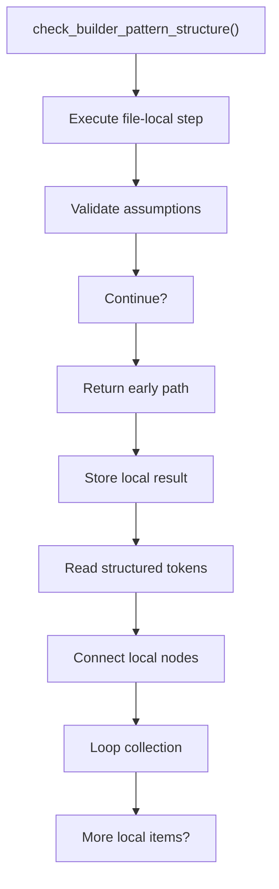
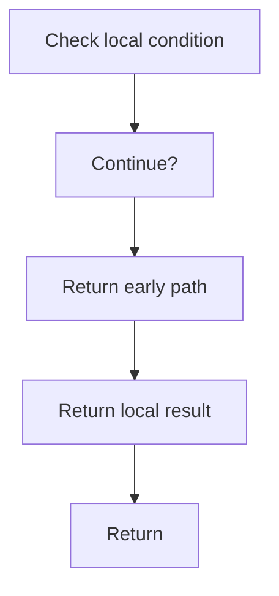

# check_builder_pattern_structure.cpp

- Source document: [builder_pattern_logic.cpp.md](../../core.cpp.md)
- Purpose: decoupled implementation logic for a future code unit.

### check_builder_pattern_structure()
This routine acts as a guard step before later logic is allowed to continue.

Inside the body, it mainly handles validate assumptions before continuing, store local findings, read local tokens, and connect local structures.

The implementation iterates over a collection or repeated workload. It branches on runtime conditions instead of following one fixed path. The caller receives a computed result or status from this step.

What it does:
- validate assumptions before continuing
- store local findings
- read local tokens
- connect local structures
- walk the local collection
- branch on local conditions

Flow:

### Block 4 - check_builder_pattern_structure() Details
#### Slice 1 - Establish Local Entry
Quick summary: This slice shows the first file-local stage for check_builder_pattern_structure.cpp and keeps the diagram scoped to this code unit.
Why this is separate: check_builder_pattern_structure.cpp has multiple branches, loops, or stage changes, so this section is split out to keep one major intent visible at a time instead of forcing one oversized diagram.

#### Slice 2 - Handle Early Decisions
Quick summary: This slice shows the first local decision path for check_builder_pattern_structure.cpp after setup.
Why this is separate: check_builder_pattern_structure.cpp has multiple branches, loops, or stage changes, so this section is split out to keep one major intent visible at a time instead of forcing one oversized diagram.

