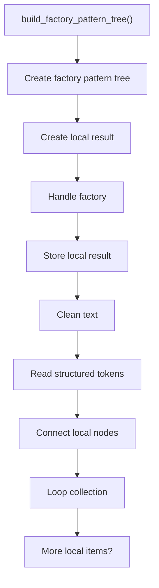
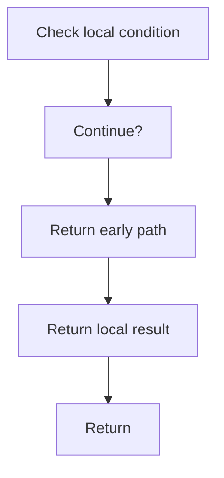

# build_factory_pattern_tree.cpp

- Source document: [factory_pattern_logic.cpp.md](../../core.cpp.md)
- Purpose: decoupled implementation logic for a future code unit.

### build_factory_pattern_tree()
This routine assembles a larger structure from the inputs it receives.

Inside the body, it mainly handles Create the local output structure, handle factory-specific detection or rewrite logic, store local findings, and normalize raw text before later parsing.

The implementation iterates over a collection or repeated workload. It branches on runtime conditions instead of following one fixed path. The caller receives a computed result or status from this step.

What it does:
- Create the local output structure
- handle factory-specific detection or rewrite logic
- store local findings
- normalize raw text before later parsing
- read local tokens
- connect local structures
- walk the local collection
- branch on local conditions

Flow:

### Block 11 - build_factory_pattern_tree() Details
#### Slice 1 - Establish Local Entry
Quick summary: This slice shows the first file-local stage for build_factory_pattern_tree.cpp and keeps the diagram scoped to this code unit.
Why this is separate: build_factory_pattern_tree.cpp has multiple branches, loops, or stage changes, so this section is split out to keep one major intent visible at a time instead of forcing one oversized diagram.

#### Slice 2 - Handle Early Decisions
Quick summary: This slice shows the first local decision path for build_factory_pattern_tree.cpp after setup.
Why this is separate: build_factory_pattern_tree.cpp has multiple branches, loops, or stage changes, so this section is split out to keep one major intent visible at a time instead of forcing one oversized diagram.

