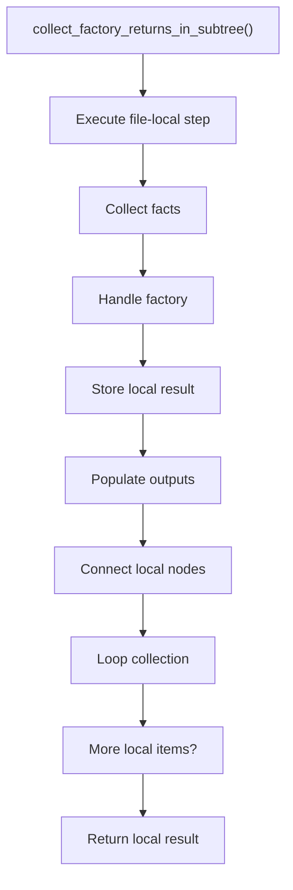
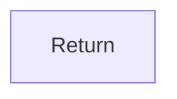

# collect_factory_returns_in_subtree.cpp

- Source document: [factory_pattern_logic.cpp.md](../../core.cpp.md)
- Purpose: decoupled implementation logic for a future code unit.

### collect_factory_returns_in_subtree()
This routine connects discovered items back into the broader model owned by the file.

Inside the body, it mainly handles collect derived facts for later stages, handle factory-specific detection or rewrite logic, store local findings, and fill local output fields.

The implementation iterates over a collection or repeated workload. The caller receives a computed result or status from this step.

What it does:
- collect derived facts for later stages
- handle factory-specific detection or rewrite logic
- store local findings
- fill local output fields
- connect local structures
- walk the local collection

Flow:

### Block 10 - collect_factory_returns_in_subtree() Details
#### Slice 1 - Establish Local Entry
Quick summary: This slice shows the first file-local stage for collect_factory_returns_in_subtree.cpp and keeps the diagram scoped to this code unit.
Why this is separate: collect_factory_returns_in_subtree.cpp has multiple branches, loops, or stage changes, so this section is split out to keep one major intent visible at a time instead of forcing one oversized diagram.

#### Slice 2 - Handle Early Decisions
Quick summary: This slice shows the first local decision path for collect_factory_returns_in_subtree.cpp after setup.
Why this is separate: collect_factory_returns_in_subtree.cpp has multiple branches, loops, or stage changes, so this section is split out to keep one major intent visible at a time instead of forcing one oversized diagram.

