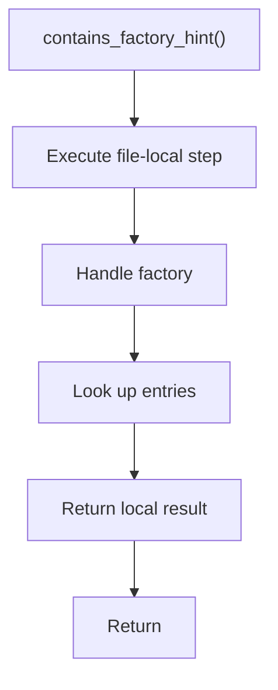

# contains_factory_hint.cpp

- Source document: [factory_pattern_logic.cpp.md](../../core.cpp.md)
- Purpose: decoupled implementation logic for a future code unit.

### contains_factory_hint()
This routine owns one focused piece of the file's behavior.

Inside the body, it mainly handles handle factory-specific detection or rewrite logic and look up local indexes.

The caller receives a computed result or status from this step.

What it does:
- handle factory-specific detection or rewrite logic
- look up local indexes

Flow:

