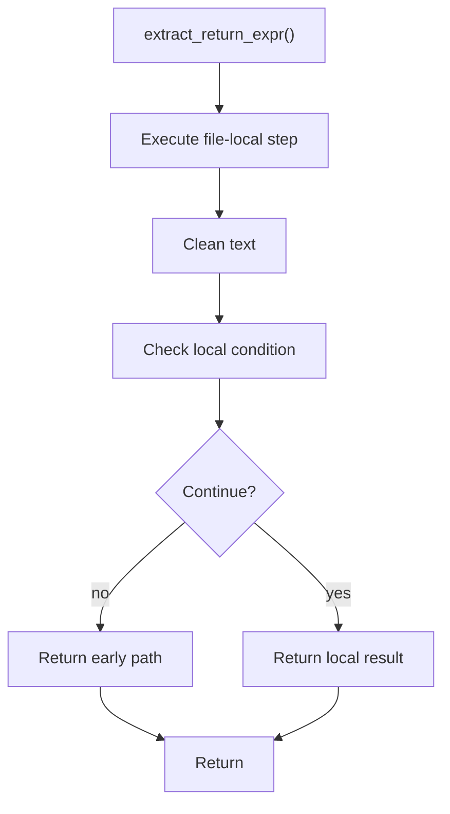

# extract_return_expr.cpp

- Source document: [factory_pattern_logic.cpp.md](../../core.cpp.md)
- Purpose: decoupled implementation logic for a future code unit.

### extract_return_expr()
This routine owns one focused piece of the file's behavior.

Inside the body, it mainly handles normalize raw text before later parsing and branch on local conditions.

It branches on runtime conditions instead of following one fixed path. The caller receives a computed result or status from this step.

What it does:
- normalize raw text before later parsing
- branch on local conditions

Flow:

