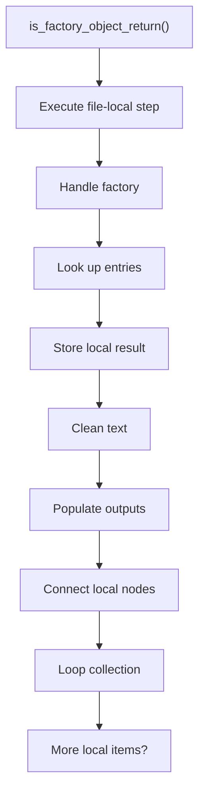
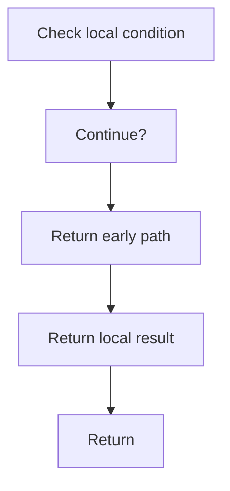

# is_factory_object_return.cpp

- Source document: [factory_pattern_logic.cpp.md](../../core.cpp.md)
- Purpose: decoupled implementation logic for a future code unit.

### is_factory_object_return()
This routine owns one focused piece of the file's behavior.

Inside the body, it mainly handles handle factory-specific detection or rewrite logic, look up local indexes, store local findings, and normalize raw text before later parsing.

The implementation iterates over a collection or repeated workload. It branches on runtime conditions instead of following one fixed path. The caller receives a computed result or status from this step.

What it does:
- handle factory-specific detection or rewrite logic
- look up local indexes
- store local findings
- normalize raw text before later parsing
- fill local output fields
- connect local structures
- walk the local collection
- branch on local conditions

Flow:

### Block 8 - is_factory_object_return() Details
#### Slice 1 - Establish Local Entry
Quick summary: This slice shows the first file-local stage for is_factory_object_return.cpp and keeps the diagram scoped to this code unit.
Why this is separate: is_factory_object_return.cpp has multiple branches, loops, or stage changes, so this section is split out to keep one major intent visible at a time instead of forcing one oversized diagram.

#### Slice 2 - Handle Early Decisions
Quick summary: This slice shows the first local decision path for is_factory_object_return.cpp after setup.
Why this is separate: is_factory_object_return.cpp has multiple branches, loops, or stage changes, so this section is split out to keep one major intent visible at a time instead of forcing one oversized diagram.

