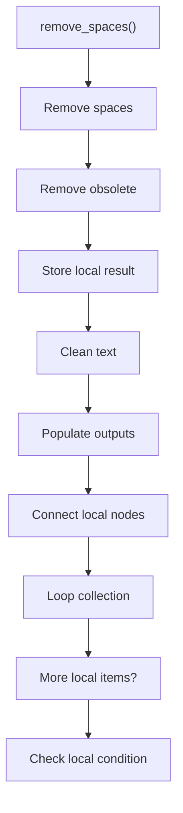
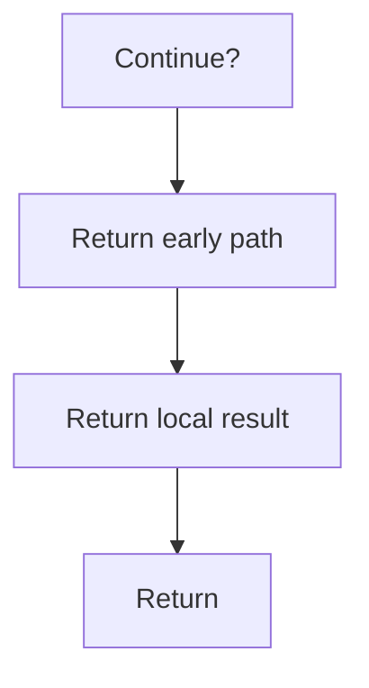

# remove_spaces.cpp

- Source document: [factory_pattern_logic.cpp.md](../../core.cpp.md)
- Purpose: decoupled implementation logic for a future code unit.

### remove_spaces()
This routine owns one focused piece of the file's behavior.

Inside the body, it mainly handles remove obsolete transformed artifacts, store local findings, normalize raw text before later parsing, and fill local output fields.

The implementation iterates over a collection or repeated workload. It branches on runtime conditions instead of following one fixed path. The caller receives a computed result or status from this step.

What it does:
- remove obsolete transformed artifacts
- store local findings
- normalize raw text before later parsing
- fill local output fields
- connect local structures
- walk the local collection
- branch on local conditions

Flow:

### Block 4 - remove_spaces() Details
#### Slice 1 - Establish Local Entry
Quick summary: This slice shows the first file-local stage for remove_spaces.cpp and keeps the diagram scoped to this code unit.
Why this is separate: remove_spaces.cpp has multiple branches, loops, or stage changes, so this section is split out to keep one major intent visible at a time instead of forcing one oversized diagram.

#### Slice 2 - Handle Early Decisions
Quick summary: This slice shows the first local decision path for remove_spaces.cpp after setup.
Why this is separate: remove_spaces.cpp has multiple branches, loops, or stage changes, so this section is split out to keep one major intent visible at a time instead of forcing one oversized diagram.

