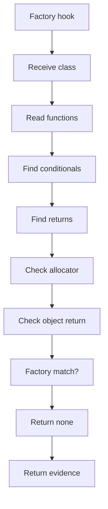
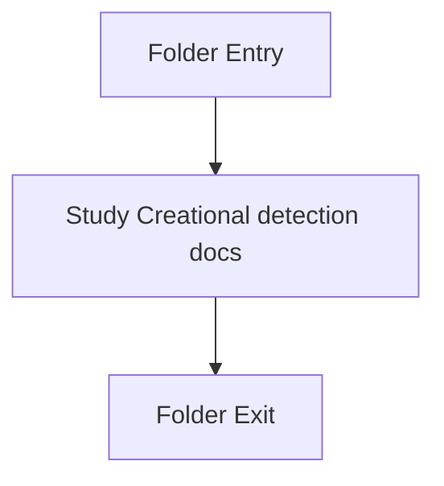

# Factory

- Folder: docs/Codebase/Microservice/Modules/Source/Analysis/Patterns/Families/Creational/Factory
- Descendant source docs: 1
- Generated on: 2026-04-23

## Logic Summary
Factory-pattern specific detection logic.

## Subsystem Story
This folder is mostly leaf-level. The local documents here carry the main explanation of the subsystem without requiring much extra descent.

## Pattern Hook Role
Factory logic should act as a pattern-specific hook, not as the owner of tree assembly. The shared creational middleman should register classes, prepare common context, and attach output nodes. Factory-specific code should only decide whether a registered class has factory evidence.

### Block 1 - Pattern Hook Role Details
#### Slice 1 - Establish Local Entry
Quick summary: This slice shows the first file-local stage for Factory and keeps the diagram scoped to this code unit.
Why this is separate: Factory has multiple branches, loops, or stage changes, so this section is split out to keep one major intent visible at a time instead of forcing one oversized diagram.

#### Slice 2 - Handle Early Decisions
Quick summary: This slice shows the first local decision path for Factory after setup.
Why this is separate: Factory has multiple branches, loops, or stage changes, so this section is split out to keep one major intent visible at a time instead of forcing one oversized diagram.

## Folder Flow

## Documents By Logic
### Creational Detection
These documents explain the local implementation by covering Implements creational pattern detection against completed class-declaration subtrees.
- factory_pattern_logic.cpp.md : Implements creational pattern detection against completed class-declaration subtrees.

## Reading Hint
- This folder is mostly leaf-level. Read the local file docs to understand the logic in this area.

