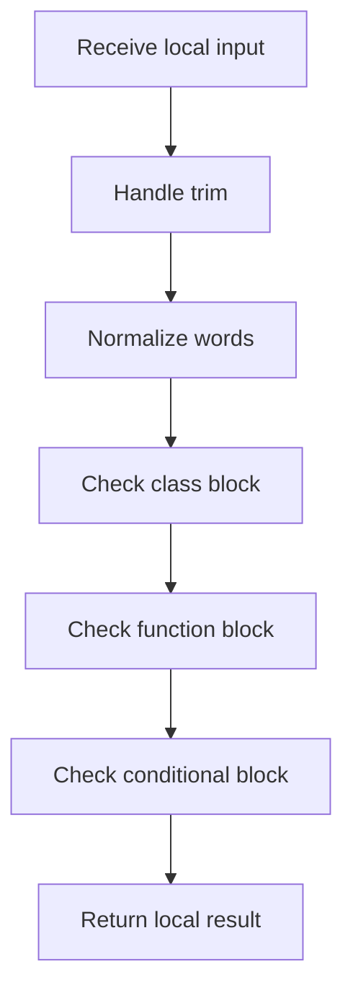

# factory_pattern_logic.cpp

- Source: Microservice/Modules/Source/Creational/Factory/factory_pattern_logic.cpp
- Kind: C++ implementation

## Story
### What Happens Here

This source file implements creational-pattern analysis against completed class-declaration subtrees. It inspects parsed structure, applies pattern-specific rules, and emits detector results that later appear in the creational tree or documentation tags.

### Why It Matters In The Flow

Runs after a specific class-declaration subtree exists so creational detection can evaluate that completed class.

### What To Watch While Reading

Implements creational pattern detection against completed class-declaration subtrees. The main surface area is easiest to track through symbols such as trim, to_lower, lowercase_ascii, and split_words. It collaborates directly with Factory/factory_pattern_logic.hpp, Language-and-Structure/language_tokens.hpp, parse_tree_symbols.hpp, and cctype.

Factory scaffold/checker logic should still conform to the shared middleman hook contract. The family-specific builder can describe a richer ordered layout, but it should return evidence through the same common interface used by the other families.

## Program Flow
Quick summary: this diagram shows the file-local activity path for this implementation unit. It stays inside this code file and uses only entry and return boundaries as external references.

Why this slice is separate: deeper helper docs can explain individual functions, while this file still needs to show the main activity path in place.

Detailed program flow is decoupled into future implementation units:

- [program_flow_01](./Flow/factory_pattern_logic_program_flow_01.cpp.md)
- [program_flow_02](./Flow/factory_pattern_logic_program_flow_02.cpp.md)
- [program_flow_03](./Flow/factory_pattern_logic_program_flow_03.cpp.md)
## Reading Map
Read this file as: Implements creational pattern detection against completed class-declaration subtrees.

Where it sits in the run: Runs after a specific class-declaration subtree exists so creational detection can evaluate that completed class.

Names worth recognizing while reading: trim, to_lower, lowercase_ascii, split_words, starts_with, and class_name_from_signature.

It leans on nearby contracts or tools such as Factory/factory_pattern_logic.hpp, Language-and-Structure/language_tokens.hpp, parse_tree_symbols.hpp, cctype, string, and unordered_map.

## Story Groups

### Small Preparation Steps
These steps clean up names, text, or small values before the larger work begins.
- trim(): Normalize or format text values, normalize raw text before later parsing, and walk the local collection
- split_words(): Split source text into smaller units, store local findings, and connect local structures

### Checks Before Moving On
These steps stop bad input or unsupported state before it can confuse the next part of the run.
- is_class_block(): Inspect or register class-level information, normalize raw text before later parsing, and branch on local conditions
- is_function_block(): look up local indexes, normalize raw text before later parsing, and branch on local conditions
- is_conditional_block(): Normalize raw text before later parsing and branch on local conditions
- is_identifier_token(): walk the local collection and branch on local conditions
- is_factory_allocator_return(): Handle factory-specific detection or rewrite logic, look up local indexes, and drop stale entries or obsolete source fragments
- is_factory_object_return(): Handle factory-specific detection or rewrite logic, look up local indexes, and store local findings

### Finding What Matters
These steps pick out the facts, traces, and relationships that later stages need.
- collect_factory_returns_in_subtree(): Collect derived facts for later stages, handle factory-specific detection or rewrite logic, and store local findings

### Building The Working Picture
These steps assemble the trees, models, or bundles used by the rest of the file.
- remove_spaces(): Remove obsolete transformed artifacts, store local findings, and normalize raw text before later parsing
- function_contains_allocator_return(): store local findings, connect local structures, and walk the local collection
- append_factory_return_if_matched(): Handle factory-specific detection or rewrite logic, store local findings, and fill local output fields
- build_factory_pattern_tree(): Create the local output structure, handle factory-specific detection or rewrite logic, and store local findings

### Main Path
These steps drive the main execution path by calling the supporting work in order.
- starts_with(): Drive the main execution path

### Supporting Steps
These steps support the local behavior of the file.
- to_lower(): Owns a focused local responsibility.
- class_name_from_signature(): Inspect or register class-level information, look up local indexes, and walk the local collection
- function_name_from_signature(): look up local indexes, normalize raw text before later parsing, and branch on local conditions
- extract_return_expr(): Normalize raw text before later parsing and branch on local conditions
- extract_type_in_angle_brackets(): look up local indexes, normalize raw text before later parsing, and branch on local conditions
- contains_factory_hint(): Handle factory-specific detection or rewrite logic and look up local indexes
- function_return_class_name(): Inspect or register class-level information, look up local indexes, and normalize raw text before later parsing

## Function Stories
Function-level logic is decoupled into future implementation units:

- [trim](./Flow/functions/trim.cpp.md)
- [to_lower](./Flow/functions/to_lower.cpp.md)
- [split_words](./Flow/functions/split_words.cpp.md)
- [starts_with](./Flow/functions/starts_with.cpp.md)
- [class_name_from_signature](./Flow/functions/class_name_from_signature.cpp.md)
- [function_name_from_signature](./Flow/functions/function_name_from_signature.cpp.md)
- [is_class_block](./Flow/functions/is_class_block.cpp.md)
- [is_function_block](./Flow/functions/is_function_block.cpp.md)
- [is_conditional_block](./Flow/functions/is_conditional_block.cpp.md)
- [extract_return_expr](./Flow/functions/extract_return_expr.cpp.md)
- [extract_type_in_angle_brackets](./Flow/functions/extract_type_in_angle_brackets.cpp.md)
- [remove_spaces](./Flow/functions/remove_spaces.cpp.md)
- [is_identifier_token](./Flow/functions/is_identifier_token.cpp.md)
- [contains_factory_hint](./Flow/functions/contains_factory_hint.cpp.md)
- [is_factory_allocator_return](./Flow/functions/is_factory_allocator_return.cpp.md)
- [function_contains_allocator_return](./Flow/functions/function_contains_allocator_return.cpp.md)
- [function_return_class_name](./Flow/functions/function_return_class_name.cpp.md)
- [is_factory_object_return](./Flow/functions/is_factory_object_return.cpp.md)
- [append_factory_return_if_matched](./Flow/functions/append_factory_return_if_matched.cpp.md)
- [collect_factory_returns_in_subtree](./Flow/functions/collect_factory_returns_in_subtree.cpp.md)
- [build_factory_pattern_tree](./Flow/functions/build_factory_pattern_tree.cpp.md)
## Documentation Note
- This markdown file is part of the generated docs/Codebase mirror.
- It was generated from the repository state on 2026-04-23 after reading the existing docs corpus and the current source tree.
