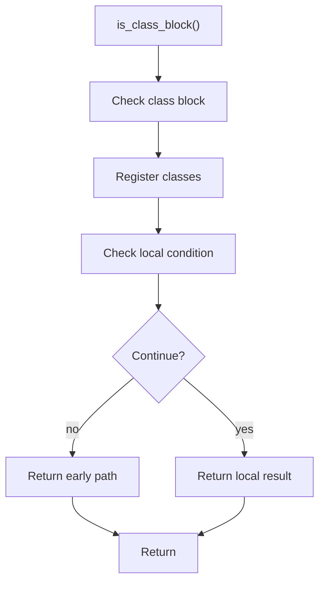

# is_class_block.cpp

- Source document: [singleton_pattern_logic.cpp.md](../../core.cpp.md)
- Purpose: decoupled implementation logic for a future code unit.

### is_class_block()
This routine owns one focused piece of the file's behavior.

Inside the body, it mainly handles inspect or register class-level information and branch on local conditions.

It branches on runtime conditions instead of following one fixed path. The caller receives a computed result or status from this step.

What it does:
- inspect or register class-level information
- branch on local conditions

Flow:

