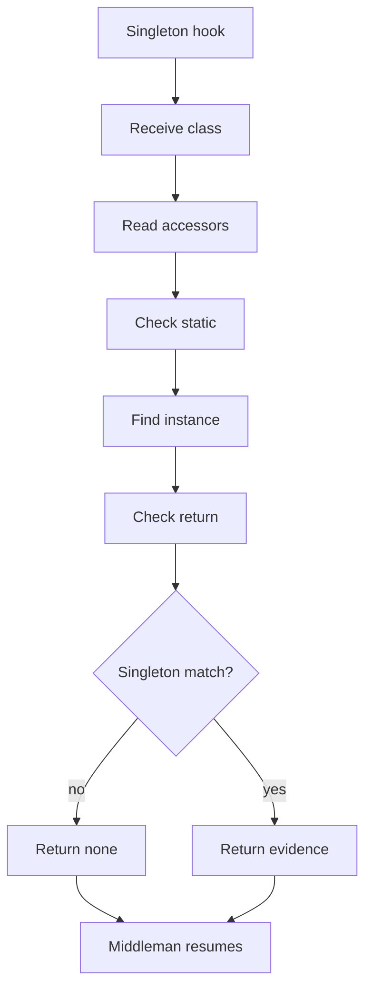
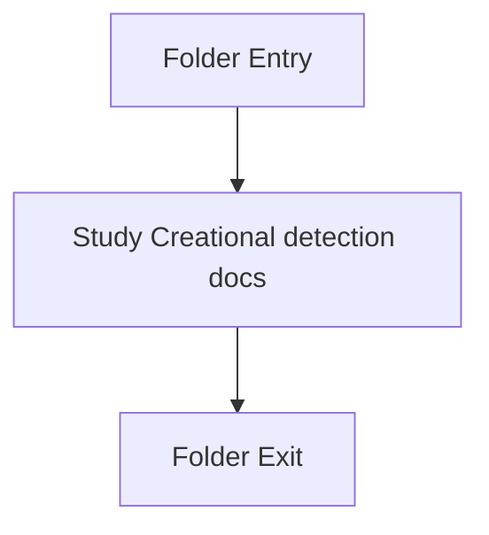

# Singleton

- Folder: docs/Codebase/Microservice/Modules/Source/Analysis/Patterns/Families/Creational/Singleton
- Descendant source docs: 1
- Generated on: 2026-04-23

## Logic Summary
Singleton-pattern specific detection logic.

## Subsystem Story
This folder is mostly leaf-level. The local documents here carry the main explanation of the subsystem without requiring much extra descent.

## Pattern Hook Role
Singleton logic should act as a pattern-specific hook, not as the owner of tree assembly. The shared creational middleman should register classes, prepare common context, and attach output nodes. Singleton-specific code should only decide whether a registered class has singleton evidence.

## Folder Flow

## Documents By Logic
### Creational Detection
These documents explain the local implementation by covering Implements creational pattern detection against completed class-declaration subtrees.
- singleton_pattern_logic.cpp.md : Implements creational pattern detection against completed class-declaration subtrees.

## Reading Hint
- This folder is mostly leaf-level. Read the local file docs to understand the logic in this area.

