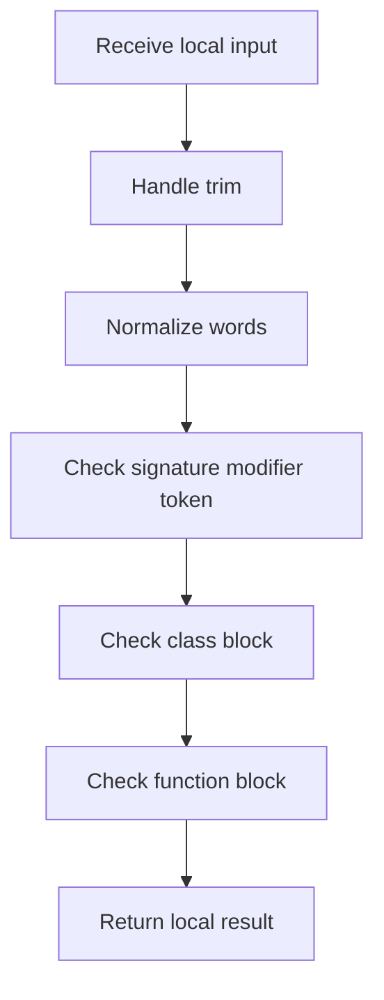

# singleton_pattern_logic.cpp

- Source: Microservice/Modules/Source/Creational/Singleton/singleton_pattern_logic.cpp
- Kind: C++ implementation

## Story
### What Happens Here

This source file implements creational-pattern analysis against completed class-declaration subtrees. It inspects parsed structure, applies pattern-specific rules, and emits detector results that later appear in the creational tree or documentation tags.

### Why It Matters In The Flow

Runs after a specific class-declaration subtree exists so creational detection can evaluate that completed class.

### What To Watch While Reading

Implements creational pattern detection against completed class-declaration subtrees. The main surface area is easiest to track through symbols such as AccessorSignatureInfo, ReturnBinding, trim, and to_lower. It collaborates directly with Singleton/singleton_pattern_logic.hpp, Language-and-Structure/language_tokens.hpp, cctype, and unordered_map.

Singleton detection should also stay inside the shared hook shape. It may use its own evidence model, but the middleman should still be able to call it like the other family detectors.

## Program Flow
Quick summary: this diagram shows the file-local activity path for this implementation unit. It stays inside this code file and uses only entry and return boundaries as external references.

Why this slice is separate: deeper helper docs can explain individual functions, while this file still needs to show the main activity path in place.

Detailed program flow is decoupled into future implementation units:

- [program_flow_01](./Flow/singleton_pattern_logic_program_flow_01.cpp.md)
- [program_flow_02](./Flow/singleton_pattern_logic_program_flow_02.cpp.md)
## Reading Map
Read this file as: Implements creational pattern detection against completed class-declaration subtrees.

Where it sits in the run: Runs after a specific class-declaration subtree exists so creational detection can evaluate that completed class.

Names worth recognizing while reading: AccessorSignatureInfo, ReturnBinding, trim, to_lower, lowercase_ascii, and starts_with.

It leans on nearby contracts or tools such as Singleton/singleton_pattern_logic.hpp, Language-and-Structure/language_tokens.hpp, cctype, unordered_map, unordered_set, and string.

## Story Groups

### Small Preparation Steps
These steps clean up names, text, or small values before the larger work begins.
- trim(): Normalize or format text values, normalize raw text before later parsing, and walk the local collection
- split_words(): Split source text into smaller units, store local findings, and connect local structures

### Checks Before Moving On
These steps stop bad input or unsupported state before it can confuse the next part of the run.
- is_signature_modifier_token(): Owns a focused local responsibility.
- is_class_block(): Inspect or register class-level information and branch on local conditions
- is_function_block(): look up local indexes, normalize raw text before later parsing, and branch on local conditions

### Building The Working Picture
These steps assemble the trees, models, or bundles used by the rest of the file.
- function_returns_static_identifier(): look up local indexes, store local findings, and fill local output fields
- build_singleton_pattern_tree(): Create the local output structure, store local findings, and read local tokens

### Main Path
These steps drive the main execution path by calling the supporting work in order.
- starts_with(): Drive the main execution path

### Supporting Steps
These steps support the local behavior of the file.
- to_lower(): Owns a focused local responsibility.
- class_name_from_signature(): Inspect or register class-level information, walk the local collection, and branch on local conditions
- function_name_from_signature(): look up local indexes, normalize raw text before later parsing, and branch on local conditions
- analyze_accessor_signature(): look up local indexes, normalize raw text before later parsing, and fill local output fields
- extract_return_binding(): Normalize raw text before later parsing, fill local output fields, and branch on local conditions
- singleton_strength_text(): branch on local conditions

## Function Stories
Function-level logic is decoupled into future implementation units:

- [trim](./Flow/functions/trim.cpp.md)
- [to_lower](./Flow/functions/to_lower.cpp.md)
- [starts_with](./Flow/functions/starts_with.cpp.md)
- [split_words](./Flow/functions/split_words.cpp.md)
- [class_name_from_signature](./Flow/functions/class_name_from_signature.cpp.md)
- [function_name_from_signature](./Flow/functions/function_name_from_signature.cpp.md)
- [is_signature_modifier_token](./Flow/functions/is_signature_modifier_token.cpp.md)
- [is_class_block](./Flow/functions/is_class_block.cpp.md)
- [is_function_block](./Flow/functions/is_function_block.cpp.md)
- [analyze_accessor_signature](./Flow/functions/analyze_accessor_signature.cpp.md)
- [extract_return_binding](./Flow/functions/extract_return_binding.cpp.md)
- [function_returns_static_identifier](./Flow/functions/function_returns_static_identifier.cpp.md)
- [singleton_strength_text](./Flow/functions/singleton_strength_text.cpp.md)
- [build_singleton_pattern_tree](./Flow/functions/build_singleton_pattern_tree.cpp.md)
## Documentation Note
- This markdown file is part of the generated docs/Codebase mirror.
- It was generated from the repository state on 2026-04-23 after reading the existing docs corpus and the current source tree.
