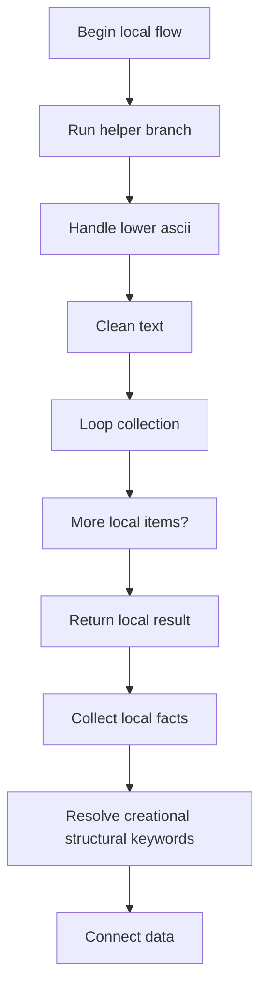
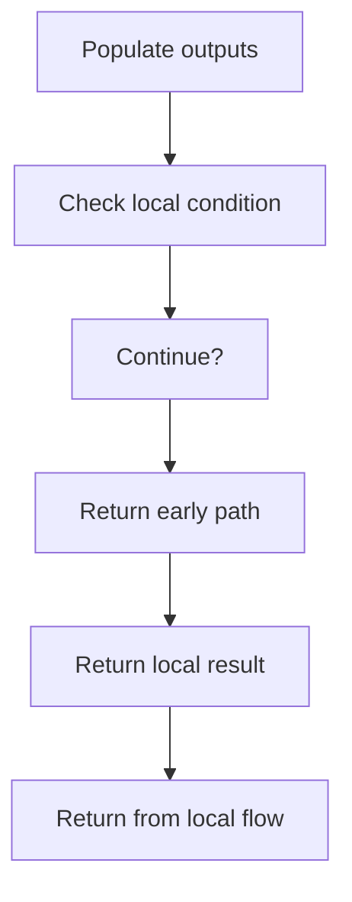
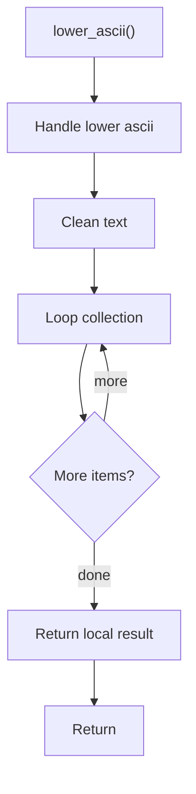
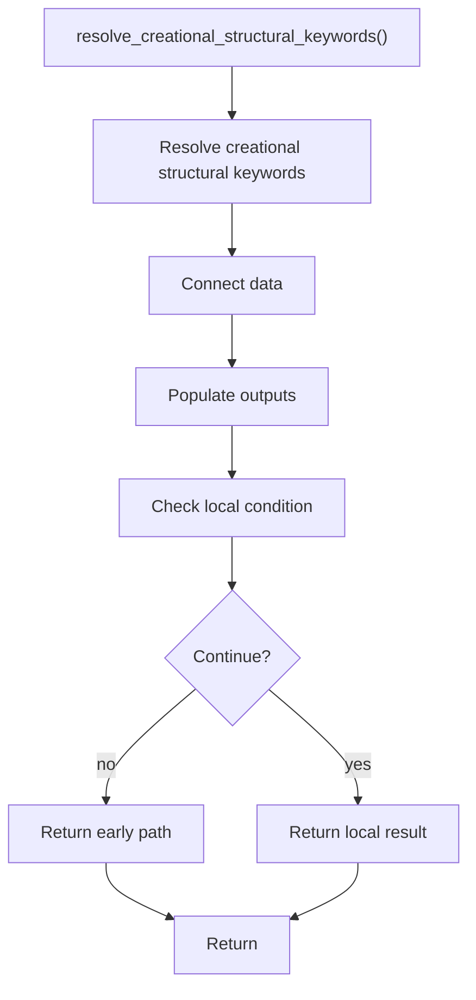

# creational_structural_hooks.cpp

- Source: Microservice/Modules/Source/Creational/Logic/creational_structural_hooks.cpp
- Kind: C++ implementation

## Story
### What Happens Here

This source file implements creational-pattern analysis against completed class-declaration subtrees. It inspects parsed structure, applies pattern-specific rules, and emits detector results that later appear in the creational tree or documentation tags.

### Why It Matters In The Flow

Runs after a specific class-declaration subtree exists so creational detection can evaluate that completed class.

### What To Watch While Reading

Implements creational pattern detection against completed class-declaration subtrees. The main surface area is easiest to track through symbols such as lower_ascii and resolve_creational_structural_keywords. It collaborates directly with Logic/creational_structural_hooks.hpp, cctype, string, and vector.

## Program Flow
This diagram follows the action path in plain words. Decision diamonds show where the file can stop, branch, or repeat work instead of simply passing through a straight line.

The flow is intentionally split into smaller slices so the major intent of creational_structural_hooks.cpp stays readable. Each slice names the stage it is covering, gives a quick summary, and explains why that stage is separated from the next one.

### Program Flow Slices
#### Slice 1 - Establish Local Entry
Quick summary: This slice shows the first file-local stage for creational_structural_hooks.cpp and keeps the diagram scoped to this code unit.
Why this is separate: creational_structural_hooks.cpp has multiple branches, loops, or stage changes, so this section is split out to keep one major intent visible at a time instead of forcing one oversized diagram.

#### Slice 2 - Handle Early Decisions
Quick summary: This slice shows the first local decision path for creational_structural_hooks.cpp after setup.
Why this is separate: creational_structural_hooks.cpp has multiple branches, loops, or stage changes, so this section is split out to keep one major intent visible at a time instead of forcing one oversized diagram.

## Reading Map
Read this file as: Implements creational pattern detection against completed class-declaration subtrees.

Where it sits in the run: Runs after a specific class-declaration subtree exists so creational detection can evaluate that completed class.

Names worth recognizing while reading: lower_ascii and resolve_creational_structural_keywords.

It leans on nearby contracts or tools such as Logic/creational_structural_hooks.hpp, cctype, string, and vector.

## Story Groups

### Finding What Matters
These steps pick out the facts, traces, and relationships that later stages need.
- resolve_creational_structural_keywords(): Connect discovered data back into the shared model, fill local output fields, and branch on local conditions

### Supporting Steps
These steps support the local behavior of the file.
- lower_ascii(): Normalize raw text before later parsing and walk the local collection

## Function Stories

### lower_ascii()
This routine owns one focused piece of the file's behavior.

Inside the body, it mainly handles normalize raw text before later parsing and walk the local collection.

The implementation iterates over a collection or repeated workload. The caller receives a computed result or status from this step.

What it does:
- normalize raw text before later parsing
- walk the local collection

Flow:

### resolve_creational_structural_keywords()
This routine connects discovered items back into the broader model owned by the file.

Inside the body, it mainly handles connect discovered data back into the shared model, fill local output fields, and branch on local conditions.

It branches on runtime conditions instead of following one fixed path. The caller receives a computed result or status from this step.

What it does:
- connect discovered data back into the shared model
- fill local output fields
- branch on local conditions

Flow:

## Documentation Note
- This markdown file is part of the generated docs/Codebase mirror.
- It was generated from the repository state on 2026-04-23 after reading the existing docs corpus and the current source tree.

