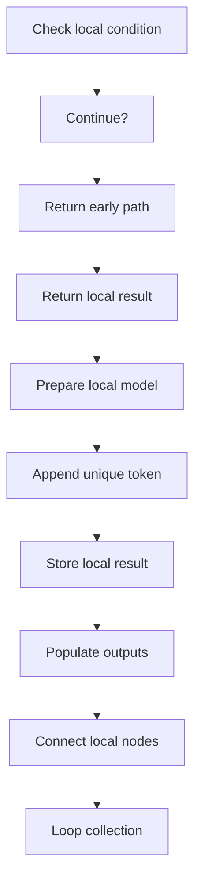
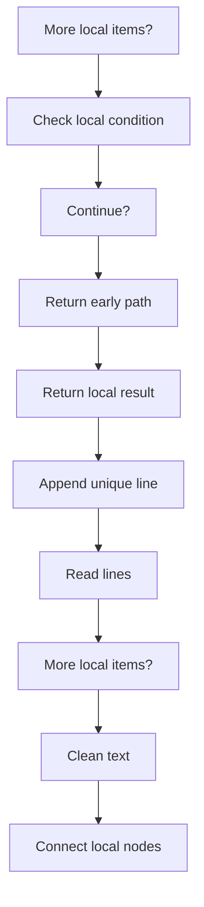
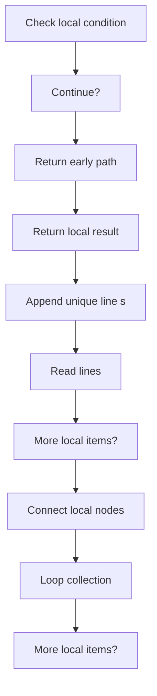
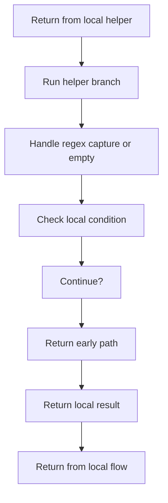

# creational_code_generator_internal_program_flow_03.cpp

- Source document: [creational_code_generator_internal.cpp.md](../core.cpp.md)
- Purpose: decoupled implementation logic for a future code unit.

#### Slice 17 - Continue Local Flow
Quick summary: This slice covers one readable stage of creational_code_generator_internal_program_flow_03.cpp without collapsing the entire flow into one oversized Mermaid block.
Why this is separate: creational_code_generator_internal_program_flow_03.cpp has multiple branches, loops, or stage changes, so this section is split out to keep one major intent visible at a time instead of forcing one oversized diagram.

#### Slice 18 - Continue Local Flow
Quick summary: This slice covers one readable stage of creational_code_generator_internal_program_flow_03.cpp without collapsing the entire flow into one oversized Mermaid block.
Why this is separate: creational_code_generator_internal_program_flow_03.cpp has multiple branches, loops, or stage changes, so this section is split out to keep one major intent visible at a time instead of forcing one oversized diagram.

#### Slice 19 - Continue Local Flow
Quick summary: This slice covers one readable stage of creational_code_generator_internal_program_flow_03.cpp without collapsing the entire flow into one oversized Mermaid block.
Why this is separate: creational_code_generator_internal_program_flow_03.cpp has multiple branches, loops, or stage changes, so this section is split out to keep one major intent visible at a time instead of forcing one oversized diagram.

#### Slice 20 - Continue Local Flow
Quick summary: This slice covers one readable stage of creational_code_generator_internal_program_flow_03.cpp without collapsing the entire flow into one oversized Mermaid block.
Why this is separate: creational_code_generator_internal_program_flow_03.cpp has multiple branches, loops, or stage changes, so this section is split out to keep one major intent visible at a time instead of forcing one oversized diagram.

