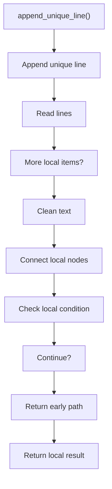

# append_unique_line.cpp

- Source document: [creational_code_generator_internal.cpp.md](../../core.cpp.md)
- Purpose: decoupled implementation logic for a future code unit.

### append_unique_line()
This helper reshapes small pieces of data so the surrounding code can stay readable.

Inside the body, it mainly handles work one source line at a time, normalize raw text before later parsing, connect local structures, and branch on local conditions.

It branches on runtime conditions instead of following one fixed path. The caller receives a computed result or status from this step.

What it does:
- work one source line at a time
- normalize raw text before later parsing
- connect local structures
- branch on local conditions

Flow:

### Block 11 - append_unique_line() Details
#### Slice 1 - Establish Local Entry
Quick summary: This slice shows the first file-local stage for append_unique_line.cpp and keeps the diagram scoped to this code unit.
Why this is separate: append_unique_line.cpp has multiple branches, loops, or stage changes, so this section is split out to keep one major intent visible at a time instead of forcing one oversized diagram.

#### Slice 2 - Handle Early Decisions
Quick summary: This slice shows the first local decision path for append_unique_line.cpp after setup.
Why this is separate: append_unique_line.cpp has multiple branches, loops, or stage changes, so this section is split out to keep one major intent visible at a time instead of forcing one oversized diagram.

