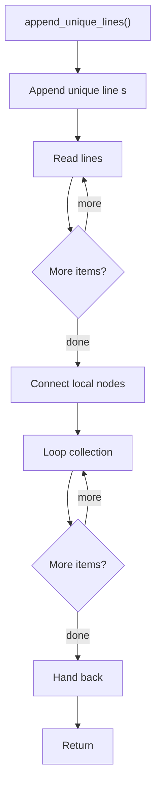

# append_unique_lines.cpp

- Source document: [creational_code_generator_internal.cpp.md](../../core.cpp.md)
- Purpose: decoupled implementation logic for a future code unit.

### append_unique_lines()
This helper reshapes small pieces of data so the surrounding code can stay readable.

Inside the body, it mainly handles work one source line at a time, connect local structures, and walk the local collection.

The implementation iterates over a collection or repeated workload.

What it does:
- work one source line at a time
- connect local structures
- walk the local collection

Flow:

