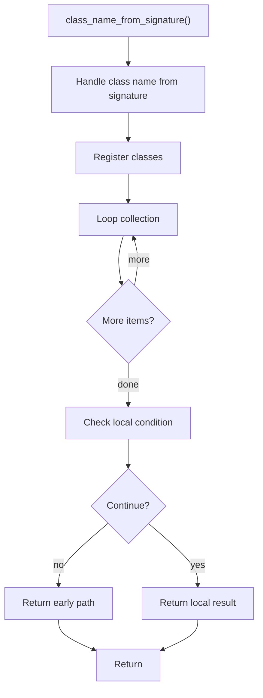

# class_name_from_signature.cpp

- Source document: [creational_code_generator_internal.cpp.md](../../core.cpp.md)
- Purpose: decoupled implementation logic for a future code unit.

### class_name_from_signature()
This routine owns one focused piece of the file's behavior.

Inside the body, it mainly handles inspect or register class-level information, walk the local collection, and branch on local conditions.

The implementation iterates over a collection or repeated workload. It branches on runtime conditions instead of following one fixed path. The caller receives a computed result or status from this step.

What it does:
- inspect or register class-level information
- walk the local collection
- branch on local conditions

Flow:

