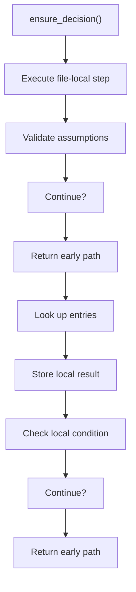
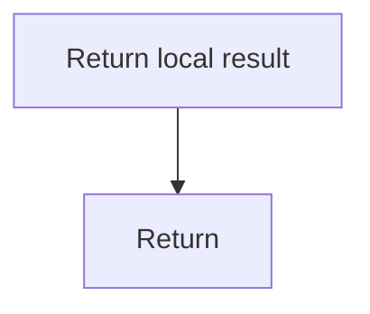

# ensure_decision.cpp

- Source document: [creational_code_generator_internal.cpp.md](../../core.cpp.md)
- Purpose: decoupled implementation logic for a future code unit.

### ensure_decision()
This routine owns one focused piece of the file's behavior.

Inside the body, it mainly handles validate assumptions before continuing, look up local indexes, store local findings, and branch on local conditions.

It branches on runtime conditions instead of following one fixed path. The caller receives a computed result or status from this step.

What it does:
- validate assumptions before continuing
- look up local indexes
- store local findings
- branch on local conditions

Flow:

### Block 6 - ensure_decision() Details
#### Slice 1 - Establish Local Entry
Quick summary: This slice shows the first file-local stage for ensure_decision.cpp and keeps the diagram scoped to this code unit.
Why this is separate: ensure_decision.cpp has multiple branches, loops, or stage changes, so this section is split out to keep one major intent visible at a time instead of forcing one oversized diagram.

#### Slice 2 - Handle Early Decisions
Quick summary: This slice shows the first local decision path for ensure_decision.cpp after setup.
Why this is separate: ensure_decision.cpp has multiple branches, loops, or stage changes, so this section is split out to keep one major intent visible at a time instead of forcing one oversized diagram.

