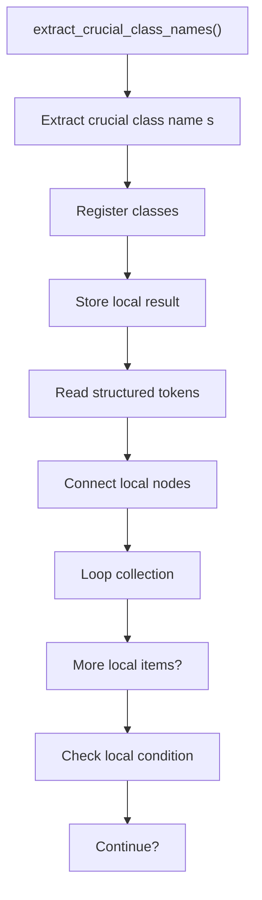
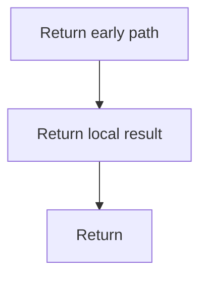

# extract_crucial_class_names.cpp

- Source document: [creational_code_generator_internal.cpp.md](../../core.cpp.md)
- Purpose: decoupled implementation logic for a future code unit.

### extract_crucial_class_names()
This routine owns one focused piece of the file's behavior.

Inside the body, it mainly handles inspect or register class-level information, store local findings, read local tokens, and connect local structures.

The implementation iterates over a collection or repeated workload. It branches on runtime conditions instead of following one fixed path. The caller receives a computed result or status from this step.

What it does:
- inspect or register class-level information
- store local findings
- read local tokens
- connect local structures
- walk the local collection
- branch on local conditions

Flow:

### Block 5 - extract_crucial_class_names() Details
#### Slice 1 - Establish Local Entry
Quick summary: This slice shows the first file-local stage for extract_crucial_class_names.cpp and keeps the diagram scoped to this code unit.
Why this is separate: extract_crucial_class_names.cpp has multiple branches, loops, or stage changes, so this section is split out to keep one major intent visible at a time instead of forcing one oversized diagram.

#### Slice 2 - Handle Early Decisions
Quick summary: This slice shows the first local decision path for extract_crucial_class_names.cpp after setup.
Why this is separate: extract_crucial_class_names.cpp has multiple branches, loops, or stage changes, so this section is split out to keep one major intent visible at a time instead of forcing one oversized diagram.

