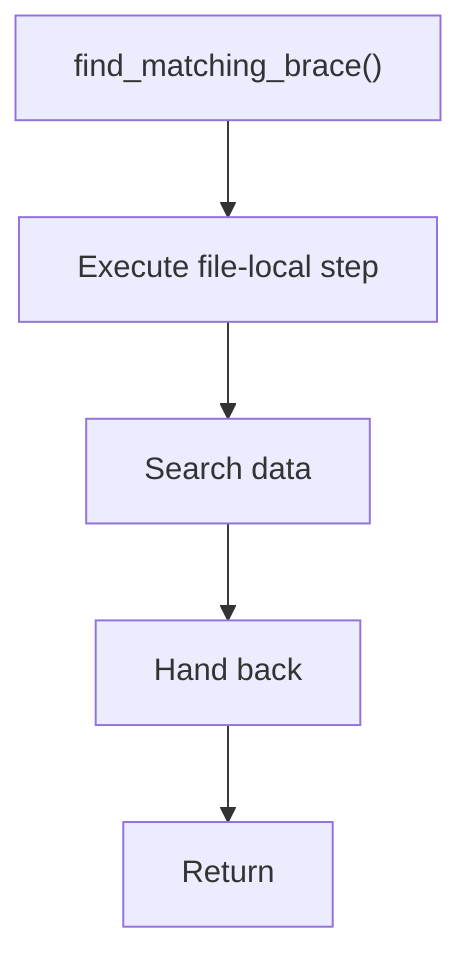

# find_matching_brace.cpp

- Source document: [creational_code_generator_internal.cpp.md](../../core.cpp.md)
- Purpose: decoupled implementation logic for a future code unit.

### find_matching_brace()
This routine owns one focused piece of the file's behavior.

Inside the body, it mainly handles search previously collected data.

What it does:
- search previously collected data

Flow:

