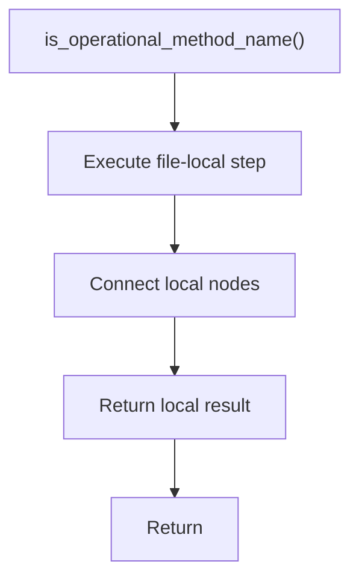

# is_operational_method_name.cpp

- Source document: [creational_code_generator_internal.cpp.md](../../core.cpp.md)
- Purpose: decoupled implementation logic for a future code unit.

### is_operational_method_name()
This routine owns one focused piece of the file's behavior.

Inside the body, it mainly handles connect local structures.

The caller receives a computed result or status from this step.

What it does:
- connect local structures

Flow:

