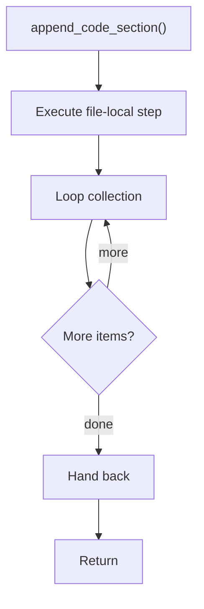

# append_code_section.cpp

- Source document: [creational_transform_evidence_render.cpp.md](../../core.cpp.md)
- Purpose: decoupled implementation logic for a future code unit.

### append_code_section()
This helper reshapes small pieces of data so the surrounding code can stay readable.

Inside the body, it mainly handles walk the local collection.

The implementation iterates over a collection or repeated workload.

What it does:
- walk the local collection

Flow:

