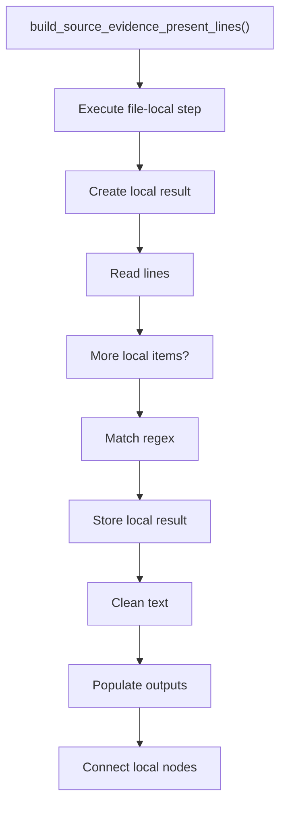
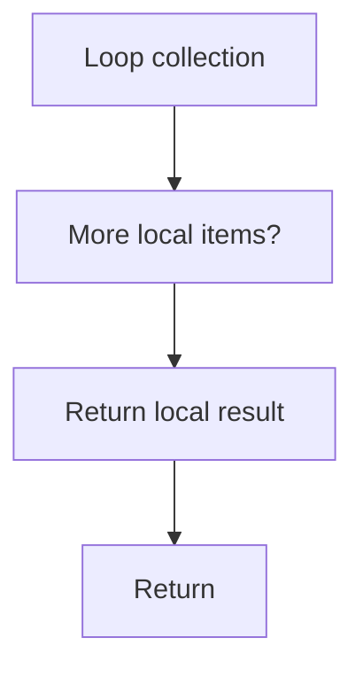

# build_source_evidence_present_lines.cpp

- Source document: [creational_transform_evidence_render.cpp.md](../../core.cpp.md)
- Purpose: decoupled implementation logic for a future code unit.

### build_source_evidence_present_lines()
This routine assembles a larger structure from the inputs it receives.

Inside the body, it mainly handles Create the local output structure, work one source line at a time, match source text with regular expressions, and store local findings.

The implementation iterates over a collection or repeated workload. It branches on runtime conditions instead of following one fixed path. The caller receives a computed result or status from this step.

What it does:
- Create the local output structure
- work one source line at a time
- match source text with regular expressions
- store local findings
- normalize raw text before later parsing
- fill local output fields
- connect local structures
- walk the local collection
- branch on local conditions

Flow:

### Block 2 - build_source_evidence_present_lines() Details
#### Slice 1 - Establish Local Entry
Quick summary: This slice shows the first file-local stage for build_source_evidence_present_lines.cpp and keeps the diagram scoped to this code unit.
Why this is separate: build_source_evidence_present_lines.cpp has multiple branches, loops, or stage changes, so this section is split out to keep one major intent visible at a time instead of forcing one oversized diagram.

#### Slice 2 - Handle Early Decisions
Quick summary: This slice shows the first local decision path for build_source_evidence_present_lines.cpp after setup.
Why this is separate: build_source_evidence_present_lines.cpp has multiple branches, loops, or stage changes, so this section is split out to keep one major intent visible at a time instead of forcing one oversized diagram.

