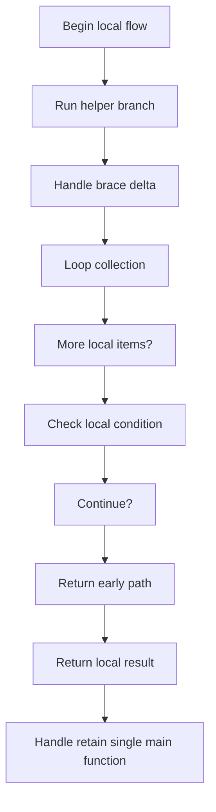
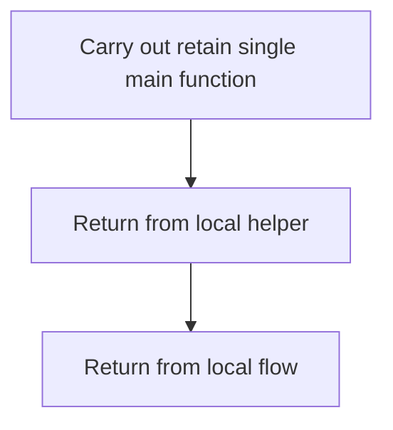
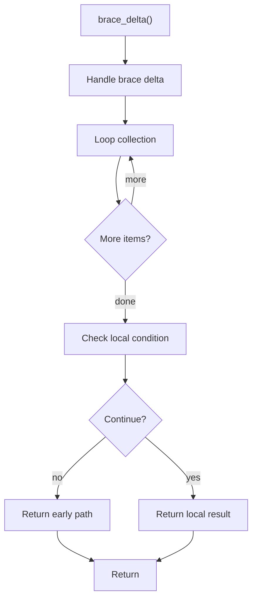
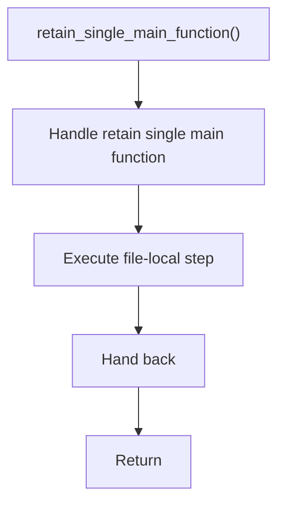

# creational_transform_evidence_main_retention.cpp

- Source: Microservice/Modules/Source/Creational/Transform/creational_transform_evidence_main_retention.cpp
- Kind: C++ implementation

## Story
### What Happens Here

This source file belongs to the older creational transform support path. It is useful for understanding previous rewrite behavior, but the current analyzer runtime focuses on tagging evidence instead of generating replacement code. This source file implements creational-pattern analysis against completed class-declaration subtrees. It inspects parsed structure, applies pattern-specific rules, and emits detector results that later appear in the creational tree or documentation tags.

### Why It Matters In The Flow

Runs after a specific class-declaration subtree exists so creational detection can evaluate that completed class.

### What To Watch While Reading

Implements creational transform dispatch, evidence rendering, and rewrite helpers. The main surface area is easiest to track through symbols such as MainOccurrence, brace_delta, retain_single_main_function, and main_signature_regex. It collaborates directly with internal/creational_transform_evidence_internal.hpp and regex.

## Program Flow
This diagram follows the action path in plain words. Decision diamonds show where the file can stop, branch, or repeat work instead of simply passing through a straight line.

The flow is intentionally split into smaller slices so the major intent of creational_transform_evidence_main_retention.cpp stays readable. Each slice names the stage it is covering, gives a quick summary, and explains why that stage is separated from the next one.

### Program Flow Slices
#### Slice 1 - Establish Local Entry
Quick summary: This slice shows the first file-local stage for creational_transform_evidence_main_retention.cpp and keeps the diagram scoped to this code unit.
Why this is separate: creational_transform_evidence_main_retention.cpp has multiple branches, loops, or stage changes, so this section is split out to keep one major intent visible at a time instead of forcing one oversized diagram.

#### Slice 2 - Handle Early Decisions
Quick summary: This slice shows the first local decision path for creational_transform_evidence_main_retention.cpp after setup.
Why this is separate: creational_transform_evidence_main_retention.cpp has multiple branches, loops, or stage changes, so this section is split out to keep one major intent visible at a time instead of forcing one oversized diagram.

## Reading Map
Read this file as: Implements creational transform dispatch, evidence rendering, and rewrite helpers.

Where it sits in the run: Runs after a specific class-declaration subtree exists so creational detection can evaluate that completed class.

Names worth recognizing while reading: MainOccurrence, brace_delta, retain_single_main_function, main_signature_regex, file_marker_regex, and join_lines.

It leans on nearby contracts or tools such as internal/creational_transform_evidence_internal.hpp and regex.

## Story Groups

### Supporting Steps
These steps support the local behavior of the file.
- brace_delta(): walk the local collection and branch on local conditions
- retain_single_main_function(): Owns a focused local responsibility.

## Function Stories

### brace_delta()
This routine owns one focused piece of the file's behavior.

Inside the body, it mainly handles walk the local collection and branch on local conditions.

The implementation iterates over a collection or repeated workload. It branches on runtime conditions instead of following one fixed path. The caller receives a computed result or status from this step.

What it does:
- walk the local collection
- branch on local conditions

Flow:

### retain_single_main_function()
This routine owns one focused piece of the file's behavior.

What it does:
- This routine is primarily structural and does not expose obvious runtime operations from static inspection.

Flow:

## Documentation Note
- This markdown file is part of the generated docs/Codebase mirror.
- It was generated from the repository state on 2026-04-23 after reading the existing docs corpus and the current source tree.

