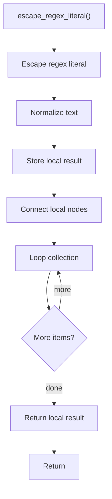

# escape_regex_literal.cpp

- Source document: [creational_transform_factory_reverse_parse_literals.cpp.md](../../core.cpp.md)
- Purpose: decoupled implementation logic for a future code unit.

### escape_regex_literal()
This helper reshapes small pieces of data so the surrounding code can stay readable.

Inside the body, it mainly handles normalize or format text values, store local findings, connect local structures, and walk the local collection.

The implementation iterates over a collection or repeated workload. The caller receives a computed result or status from this step.

What it does:
- normalize or format text values
- store local findings
- connect local structures
- walk the local collection

Flow:

