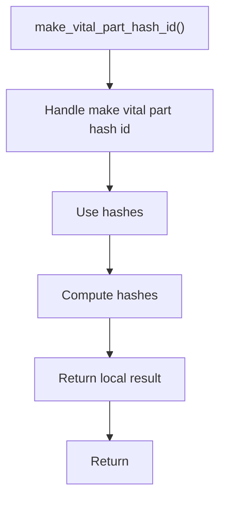

# make_vital_part_hash_id.cpp

- Source document: [creational_transform_factory_reverse_parse_literals.cpp.md](../../core.cpp.md)
- Purpose: decoupled implementation logic for a future code unit.

### make_vital_part_hash_id()
This routine assembles a larger structure from the inputs it receives.

Inside the body, it mainly handles compute or reuse hash-oriented identifiers and compute hash metadata.

The caller receives a computed result or status from this step.

What it does:
- compute or reuse hash-oriented identifiers
- compute hash metadata

Flow:

