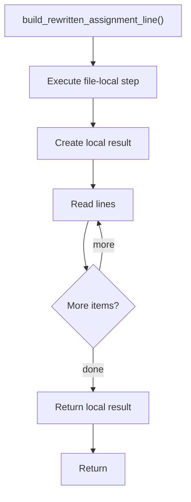

# build_rewritten_assignment_line.cpp

- Source document: [creational_transform_factory_reverse_rewrite.cpp.md](../../core.cpp.md)
- Purpose: decoupled implementation logic for a future code unit.

### build_rewritten_assignment_line()
This routine assembles a larger structure from the inputs it receives.

Inside the body, it mainly handles Create the local output structure and work one source line at a time.

The caller receives a computed result or status from this step.

What it does:
- Create the local output structure
- work one source line at a time

Flow:

