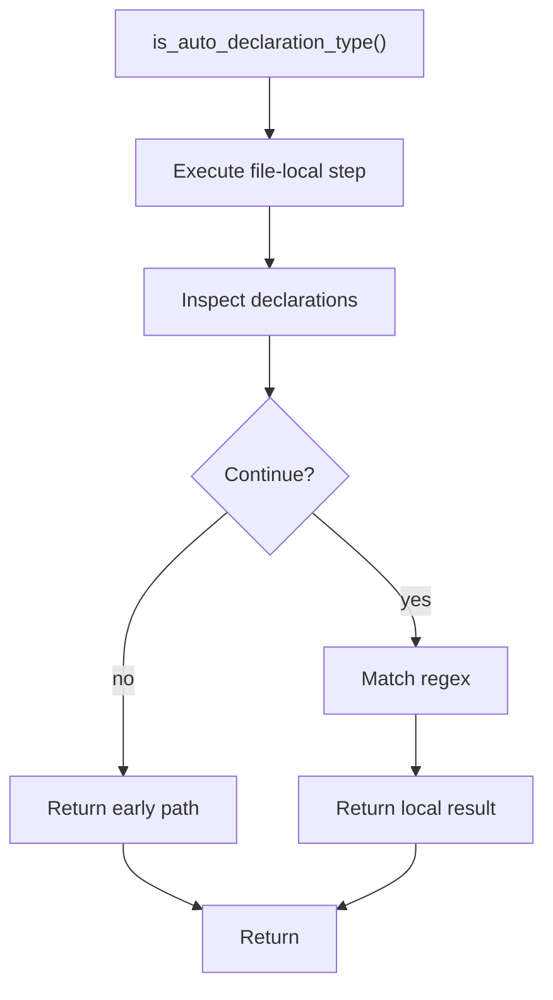

# is_auto_declaration_type.cpp

- Source document: [creational_transform_factory_reverse_rewrite.cpp.md](../../core.cpp.md)
- Purpose: decoupled implementation logic for a future code unit.

### is_auto_declaration_type()
This routine owns one focused piece of the file's behavior.

Inside the body, it mainly handles inspect or rewrite declarations and match source text with regular expressions.

The caller receives a computed result or status from this step.

What it does:
- inspect or rewrite declarations
- match source text with regular expressions

Flow:

