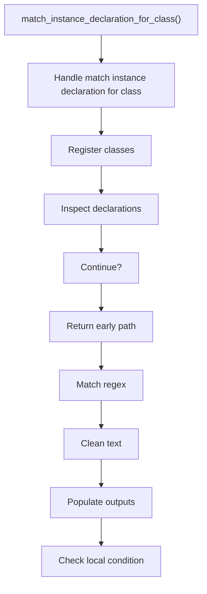
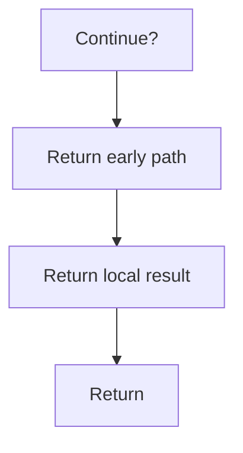

# match_instance_declaration_for_class.cpp

- Source document: [creational_transform_factory_reverse_rewrite.cpp.md](../../core.cpp.md)
- Purpose: decoupled implementation logic for a future code unit.

### match_instance_declaration_for_class()
This routine owns one focused piece of the file's behavior.

Inside the body, it mainly handles inspect or register class-level information, inspect or rewrite declarations, match source text with regular expressions, and normalize raw text before later parsing.

It branches on runtime conditions instead of following one fixed path. The caller receives a computed result or status from this step.

What it does:
- inspect or register class-level information
- inspect or rewrite declarations
- match source text with regular expressions
- normalize raw text before later parsing
- fill local output fields
- branch on local conditions

Flow:

### Block 2 - match_instance_declaration_for_class() Details
#### Slice 1 - Establish Local Entry
Quick summary: This slice shows the first file-local stage for match_instance_declaration_for_class.cpp and keeps the diagram scoped to this code unit.
Why this is separate: match_instance_declaration_for_class.cpp has multiple branches, loops, or stage changes, so this section is split out to keep one major intent visible at a time instead of forcing one oversized diagram.

#### Slice 2 - Handle Early Decisions
Quick summary: This slice shows the first local decision path for match_instance_declaration_for_class.cpp after setup.
Why this is separate: match_instance_declaration_for_class.cpp has multiple branches, loops, or stage changes, so this section is split out to keep one major intent visible at a time instead of forcing one oversized diagram.

