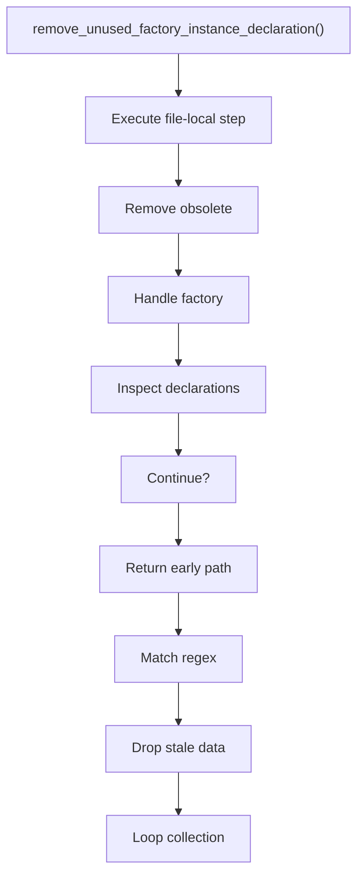
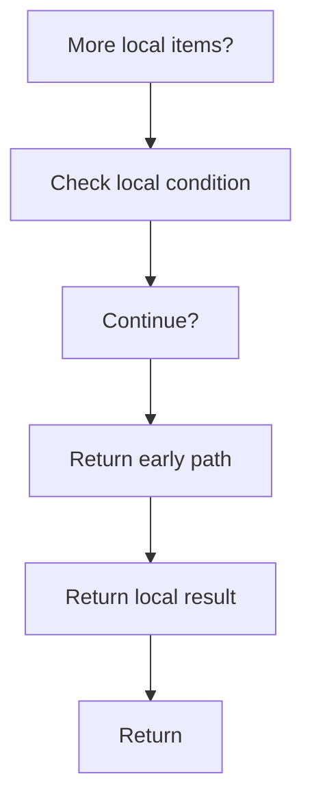

# remove_unused_factory_instance_declaration.cpp

- Source document: [creational_transform_factory_reverse_rewrite.cpp.md](../../core.cpp.md)
- Purpose: decoupled implementation logic for a future code unit.

### remove_unused_factory_instance_declaration()
This routine owns one focused piece of the file's behavior.

Inside the body, it mainly handles remove obsolete transformed artifacts, handle factory-specific detection or rewrite logic, inspect or rewrite declarations, and match source text with regular expressions.

The implementation iterates over a collection or repeated workload. It branches on runtime conditions instead of following one fixed path. The caller receives a computed result or status from this step.

What it does:
- remove obsolete transformed artifacts
- handle factory-specific detection or rewrite logic
- inspect or rewrite declarations
- match source text with regular expressions
- drop stale entries or obsolete source fragments
- walk the local collection
- branch on local conditions

Flow:

### Block 9 - remove_unused_factory_instance_declaration() Details
#### Slice 1 - Establish Local Entry
Quick summary: This slice shows the first file-local stage for remove_unused_factory_instance_declaration.cpp and keeps the diagram scoped to this code unit.
Why this is separate: remove_unused_factory_instance_declaration.cpp has multiple branches, loops, or stage changes, so this section is split out to keep one major intent visible at a time instead of forcing one oversized diagram.

#### Slice 2 - Handle Early Decisions
Quick summary: This slice shows the first local decision path for remove_unused_factory_instance_declaration.cpp after setup.
Why this is separate: remove_unused_factory_instance_declaration.cpp has multiple branches, loops, or stage changes, so this section is split out to keep one major intent visible at a time instead of forcing one oversized diagram.

