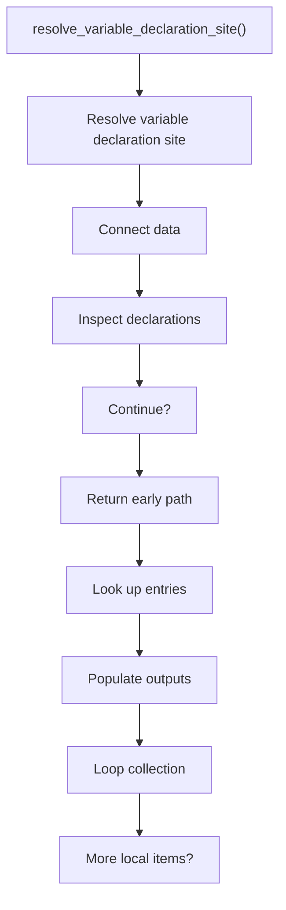
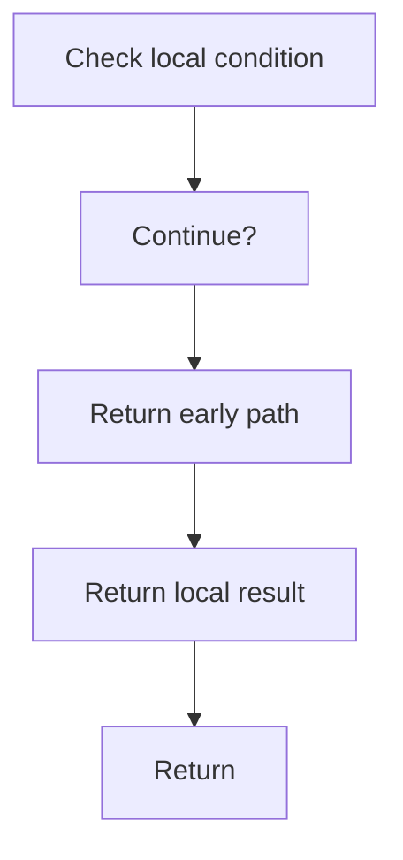

# resolve_variable_declaration_site.cpp

- Source document: [creational_transform_factory_reverse_rewrite.cpp.md](../../core.cpp.md)
- Purpose: decoupled implementation logic for a future code unit.

### resolve_variable_declaration_site()
This routine connects discovered items back into the broader model owned by the file.

Inside the body, it mainly handles connect discovered data back into the shared model, inspect or rewrite declarations, look up local indexes, and fill local output fields.

The implementation iterates over a collection or repeated workload. It branches on runtime conditions instead of following one fixed path. The caller receives a computed result or status from this step.

What it does:
- connect discovered data back into the shared model
- inspect or rewrite declarations
- look up local indexes
- fill local output fields
- walk the local collection
- branch on local conditions

Flow:

### Block 6 - resolve_variable_declaration_site() Details
#### Slice 1 - Establish Local Entry
Quick summary: This slice shows the first file-local stage for resolve_variable_declaration_site.cpp and keeps the diagram scoped to this code unit.
Why this is separate: resolve_variable_declaration_site.cpp has multiple branches, loops, or stage changes, so this section is split out to keep one major intent visible at a time instead of forcing one oversized diagram.

#### Slice 2 - Handle Early Decisions
Quick summary: This slice shows the first local decision path for resolve_variable_declaration_site.cpp after setup.
Why this is separate: resolve_variable_declaration_site.cpp has multiple branches, loops, or stage changes, so this section is split out to keep one major intent visible at a time instead of forcing one oversized diagram.

