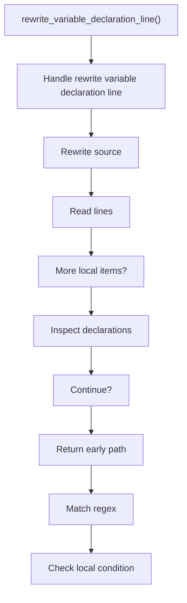
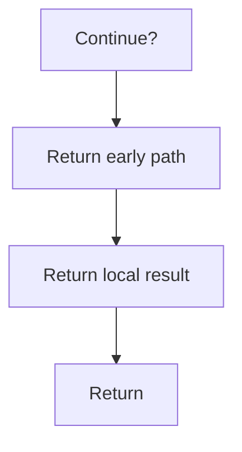

# rewrite_variable_declaration_line.cpp

- Source document: [creational_transform_factory_reverse_rewrite.cpp.md](../../core.cpp.md)
- Purpose: decoupled implementation logic for a future code unit.

### rewrite_variable_declaration_line()
This routine owns one focused piece of the file's behavior.

Inside the body, it mainly handles rewrite source text or model state, work one source line at a time, inspect or rewrite declarations, and match source text with regular expressions.

It branches on runtime conditions instead of following one fixed path. The caller receives a computed result or status from this step.

What it does:
- rewrite source text or model state
- work one source line at a time
- inspect or rewrite declarations
- match source text with regular expressions
- branch on local conditions

Flow:

### Block 8 - rewrite_variable_declaration_line() Details
#### Slice 1 - Establish Local Entry
Quick summary: This slice shows the first file-local stage for rewrite_variable_declaration_line.cpp and keeps the diagram scoped to this code unit.
Why this is separate: rewrite_variable_declaration_line.cpp has multiple branches, loops, or stage changes, so this section is split out to keep one major intent visible at a time instead of forcing one oversized diagram.

#### Slice 2 - Handle Early Decisions
Quick summary: This slice shows the first local decision path for rewrite_variable_declaration_line.cpp after setup.
Why this is separate: rewrite_variable_declaration_line.cpp has multiple branches, loops, or stage changes, so this section is split out to keep one major intent visible at a time instead of forcing one oversized diagram.

