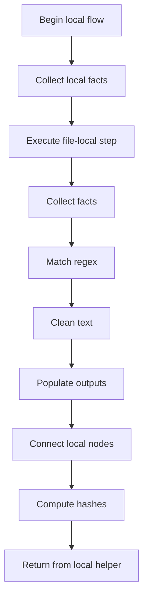
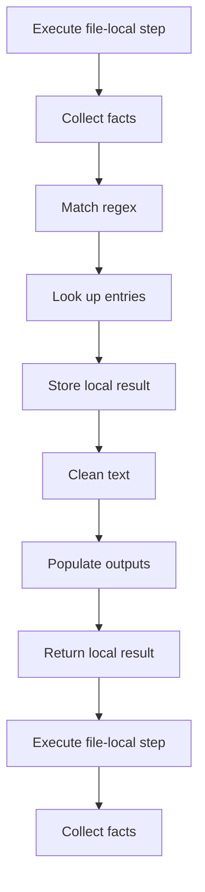
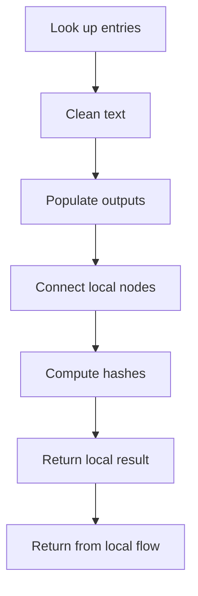
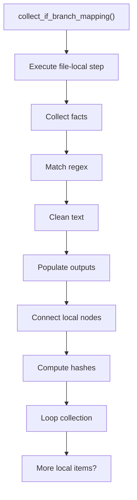
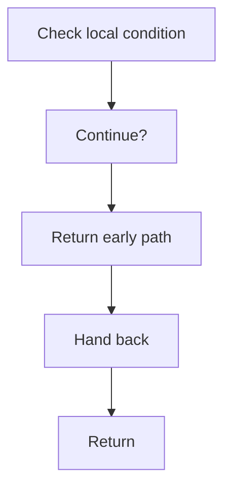
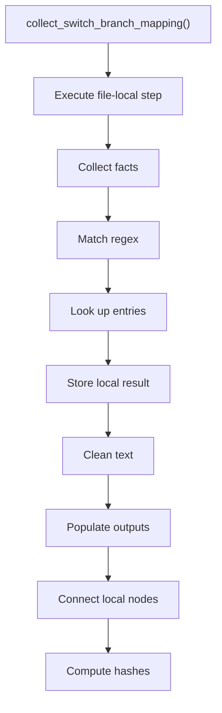
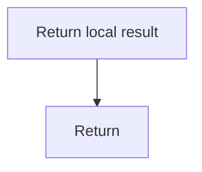
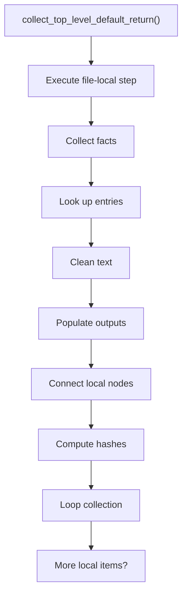
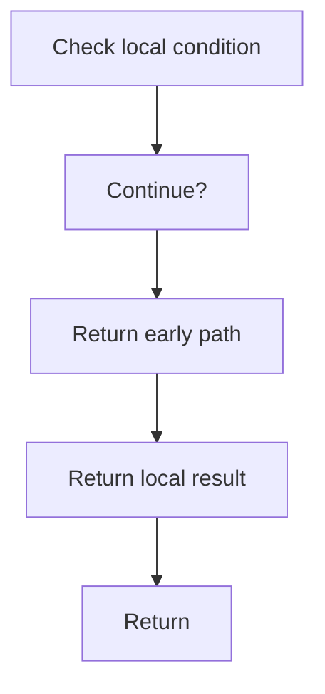

# creational_transform_factory_reverse_parse_mapping.cpp

- Source: Microservice/Modules/Source/Creational/Transform/creational_transform_factory_reverse_parse_mapping.cpp
- Kind: C++ implementation

## Story
### What Happens Here

This source file belongs to the older creational transform support path. It is useful for understanding previous rewrite behavior, but the current analyzer runtime focuses on tagging evidence instead of generating replacement code. This source file implements creational-pattern analysis against completed class-declaration subtrees. It inspects parsed structure, applies pattern-specific rules, and emits detector results that later appear in the creational tree or documentation tags.

### Why It Matters In The Flow

Runs after a specific class-declaration subtree exists so creational detection can evaluate that completed class.

### What To Watch While Reading

Implements creational transform dispatch, evidence rendering, and rewrite helpers. The main surface area is easiest to track through symbols such as SwitchLabel, collect_if_branch_mapping, if_condition_regex, and collect_switch_branch_mapping. It collaborates directly with internal/creational_transform_factory_reverse_internal.hpp, Transform/creational_code_generator_internal.hpp, cctype, and regex.

## Program Flow
This diagram follows the action path in plain words. Decision diamonds show where the file can stop, branch, or repeat work instead of simply passing through a straight line.

The flow is intentionally split into smaller slices so the major intent of creational_transform_factory_reverse_parse_mapping.cpp stays readable. Each slice names the stage it is covering, gives a quick summary, and explains why that stage is separated from the next one.

### Program Flow Slices
#### Slice 1 - Establish Local Entry
Quick summary: This slice shows the first file-local stage for creational_transform_factory_reverse_parse_mapping.cpp and keeps the diagram scoped to this code unit.
Why this is separate: creational_transform_factory_reverse_parse_mapping.cpp has multiple branches, loops, or stage changes, so this section is split out to keep one major intent visible at a time instead of forcing one oversized diagram.

#### Slice 2 - Handle Early Decisions
Quick summary: This slice shows the first local decision path for creational_transform_factory_reverse_parse_mapping.cpp after setup.
Why this is separate: creational_transform_factory_reverse_parse_mapping.cpp has multiple branches, loops, or stage changes, so this section is split out to keep one major intent visible at a time instead of forcing one oversized diagram.

#### Slice 3 - Hand Off Local State
Quick summary: This slice shows how creational_transform_factory_reverse_parse_mapping.cpp passes prepared local state into its next operation.
Why this is separate: creational_transform_factory_reverse_parse_mapping.cpp has multiple branches, loops, or stage changes, so this section is split out to keep one major intent visible at a time instead of forcing one oversized diagram.

## Reading Map
Read this file as: Implements creational transform dispatch, evidence rendering, and rewrite helpers.

Where it sits in the run: Runs after a specific class-declaration subtree exists so creational detection can evaluate that completed class.

Names worth recognizing while reading: SwitchLabel, collect_if_branch_mapping, if_condition_regex, collect_switch_branch_mapping, switch_regex, and label_regex.

It leans on nearby contracts or tools such as internal/creational_transform_factory_reverse_internal.hpp, Transform/creational_code_generator_internal.hpp, cctype, regex, string, and vector.

## Story Groups

### Finding What Matters
These steps pick out the facts, traces, and relationships that later stages need.
- collect_if_branch_mapping(): Collect derived facts for later stages, match source text with regular expressions, and normalize raw text before later parsing
- collect_switch_branch_mapping(): Collect derived facts for later stages, match source text with regular expressions, and look up local indexes
- collect_top_level_default_return(): Collect derived facts for later stages, look up local indexes, and normalize raw text before later parsing

## Function Stories

### collect_if_branch_mapping()
This routine connects discovered items back into the broader model owned by the file.

Inside the body, it mainly handles collect derived facts for later stages, match source text with regular expressions, normalize raw text before later parsing, and fill local output fields.

The implementation iterates over a collection or repeated workload. It branches on runtime conditions instead of following one fixed path.

What it does:
- collect derived facts for later stages
- match source text with regular expressions
- normalize raw text before later parsing
- fill local output fields
- connect local structures
- compute hash metadata
- walk the local collection
- branch on local conditions

Flow:

### Block 2 - collect_if_branch_mapping() Details
#### Slice 1 - Establish Local Entry
Quick summary: This slice shows the first file-local stage for creational_transform_factory_reverse_parse_mapping.cpp and keeps the diagram scoped to this code unit.
Why this is separate: creational_transform_factory_reverse_parse_mapping.cpp has multiple branches, loops, or stage changes, so this section is split out to keep one major intent visible at a time instead of forcing one oversized diagram.

#### Slice 2 - Handle Early Decisions
Quick summary: This slice shows the first local decision path for creational_transform_factory_reverse_parse_mapping.cpp after setup.
Why this is separate: creational_transform_factory_reverse_parse_mapping.cpp has multiple branches, loops, or stage changes, so this section is split out to keep one major intent visible at a time instead of forcing one oversized diagram.

### collect_switch_branch_mapping()
This routine connects discovered items back into the broader model owned by the file.

Inside the body, it mainly handles collect derived facts for later stages, match source text with regular expressions, look up local indexes, and store local findings.

The implementation iterates over a collection or repeated workload. It branches on runtime conditions instead of following one fixed path. The caller receives a computed result or status from this step.

What it does:
- collect derived facts for later stages
- match source text with regular expressions
- look up local indexes
- store local findings
- normalize raw text before later parsing
- fill local output fields
- connect local structures
- compute hash metadata
- walk the local collection
- branch on local conditions

Flow:

### Block 3 - collect_switch_branch_mapping() Details
#### Slice 1 - Establish Local Entry
Quick summary: This slice shows the first file-local stage for creational_transform_factory_reverse_parse_mapping.cpp and keeps the diagram scoped to this code unit.
Why this is separate: creational_transform_factory_reverse_parse_mapping.cpp has multiple branches, loops, or stage changes, so this section is split out to keep one major intent visible at a time instead of forcing one oversized diagram.

#### Slice 2 - Handle Early Decisions
Quick summary: This slice shows the first local decision path for creational_transform_factory_reverse_parse_mapping.cpp after setup.
Why this is separate: creational_transform_factory_reverse_parse_mapping.cpp has multiple branches, loops, or stage changes, so this section is split out to keep one major intent visible at a time instead of forcing one oversized diagram.

### collect_top_level_default_return()
This routine connects discovered items back into the broader model owned by the file.

Inside the body, it mainly handles collect derived facts for later stages, look up local indexes, normalize raw text before later parsing, and fill local output fields.

The implementation iterates over a collection or repeated workload. It branches on runtime conditions instead of following one fixed path. The caller receives a computed result or status from this step.

What it does:
- collect derived facts for later stages
- look up local indexes
- normalize raw text before later parsing
- fill local output fields
- connect local structures
- compute hash metadata
- walk the local collection
- branch on local conditions

Flow:

### Block 4 - collect_top_level_default_return() Details
#### Slice 1 - Establish Local Entry
Quick summary: This slice shows the first file-local stage for creational_transform_factory_reverse_parse_mapping.cpp and keeps the diagram scoped to this code unit.
Why this is separate: creational_transform_factory_reverse_parse_mapping.cpp has multiple branches, loops, or stage changes, so this section is split out to keep one major intent visible at a time instead of forcing one oversized diagram.

#### Slice 2 - Handle Early Decisions
Quick summary: This slice shows the first local decision path for creational_transform_factory_reverse_parse_mapping.cpp after setup.
Why this is separate: creational_transform_factory_reverse_parse_mapping.cpp has multiple branches, loops, or stage changes, so this section is split out to keep one major intent visible at a time instead of forcing one oversized diagram.

## Documentation Note
- This markdown file is part of the generated docs/Codebase mirror.
- It was generated from the repository state on 2026-04-23 after reading the existing docs corpus and the current source tree.

