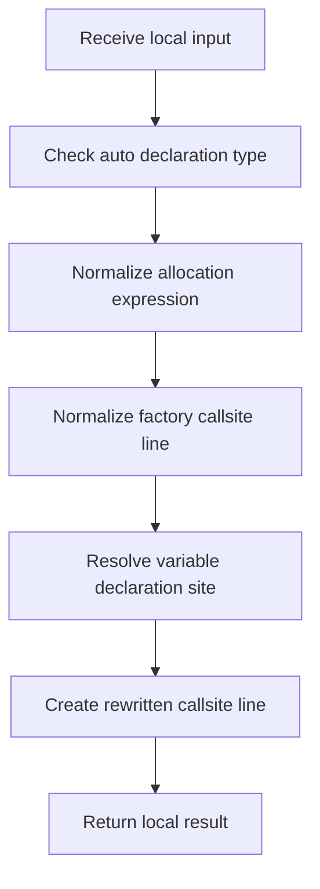

# creational_transform_factory_reverse_rewrite.cpp

- Source: Microservice/Modules/Source/Creational/Transform/creational_transform_factory_reverse_rewrite.cpp
- Kind: C++ implementation

## Story
### What Happens Here

This source file belongs to the older creational transform support path. It is useful for understanding previous rewrite behavior, but the current analyzer runtime focuses on tagging evidence instead of generating replacement code. This source file implements creational-pattern analysis against completed class-declaration subtrees. It inspects parsed structure, applies pattern-specific rules, and emits detector results that later appear in the creational tree or documentation tags.

### Why It Matters In The Flow

Runs after a specific class-declaration subtree exists so creational detection can evaluate that completed class.

### What To Watch While Reading

Implements creational transform dispatch, evidence rendering, and rewrite helpers. The main surface area is easiest to track through symbols such as match_instance_declaration_for_class, declaration_regex, match_simple_variable_declaration, and parse_allocation_expression. It collaborates directly with internal/creational_transform_factory_reverse_internal.hpp, Transform/creational_code_generator_internal.hpp, regex, and string.

## Program Flow
Quick summary: this diagram shows the file-local activity path for this implementation unit. It stays inside this code file and uses only entry and return boundaries as external references.

Why this slice is separate: deeper helper docs can explain individual functions, while this file still needs to show the main activity path in place.

Detailed program flow is decoupled into future implementation units:

- [program_flow_01](./RewriteFlow/creational_transform_factory_reverse_rewrite_program_flow_01.cpp.md)
- [program_flow_02](./RewriteFlow/creational_transform_factory_reverse_rewrite_program_flow_02.cpp.md)
## Reading Map
Read this file as: Implements creational transform dispatch, evidence rendering, and rewrite helpers.

Where it sits in the run: Runs after a specific class-declaration subtree exists so creational detection can evaluate that completed class.

Names worth recognizing while reading: match_instance_declaration_for_class, declaration_regex, match_simple_variable_declaration, parse_allocation_expression, make_unique_regex, and make_shared_regex.

It leans on nearby contracts or tools such as internal/creational_transform_factory_reverse_internal.hpp, Transform/creational_code_generator_internal.hpp, regex, and string.

## Story Groups

### Checks Before Moving On
These steps stop bad input or unsupported state before it can confuse the next part of the run.
- is_auto_declaration_type(): Inspect or rewrite declarations and match source text with regular expressions

### Reading The Input
These steps turn raw text or arguments into something the program can follow.
- parse_allocation_expression(): Parse source text into structured values, match source text with regular expressions, and normalize raw text before later parsing
- parse_factory_callsite_line(): Parse source text into structured values, handle factory-specific detection or rewrite logic, and work one source line at a time

### Finding What Matters
These steps pick out the facts, traces, and relationships that later stages need.
- resolve_variable_declaration_site(): Connect discovered data back into the shared model, inspect or rewrite declarations, and look up local indexes

### Building The Working Picture
These steps assemble the trees, models, or bundles used by the rest of the file.
- build_rewritten_callsite_line(): Create the local output structure, work one source line at a time, and recognize or rewrite callsite structure
- build_rewritten_assignment_line(): Create the local output structure and work one source line at a time

### Changing Or Cleaning The Picture
These steps adjust existing state or remove stale pieces after better information is available.
- rewrite_declaration_type(): Rewrite source text or model state, inspect or rewrite declarations, and match source text with regular expressions
- rewrite_variable_declaration_line(): Rewrite source text or model state, work one source line at a time, and inspect or rewrite declarations
- remove_unused_factory_instance_declaration(): Remove obsolete transformed artifacts, handle factory-specific detection or rewrite logic, and inspect or rewrite declarations

### Supporting Steps
These steps support the local behavior of the file.
- match_instance_declaration_for_class(): Inspect or register class-level information, inspect or rewrite declarations, and match source text with regular expressions
- match_simple_variable_declaration(): Inspect or rewrite declarations, match source text with regular expressions, and normalize raw text before later parsing

## Function Stories
Function-level logic is decoupled into future implementation units:

- [match_instance_declaration_for_class](./RewriteFlow/functions/match_instance_declaration_for_class.cpp.md)
- [match_simple_variable_declaration](./RewriteFlow/functions/match_simple_variable_declaration.cpp.md)
- [parse_allocation_expression](./RewriteFlow/functions/parse_allocation_expression.cpp.md)
- [is_auto_declaration_type](./RewriteFlow/functions/is_auto_declaration_type.cpp.md)
- [rewrite_declaration_type](./RewriteFlow/functions/rewrite_declaration_type.cpp.md)
- [resolve_variable_declaration_site](./RewriteFlow/functions/resolve_variable_declaration_site.cpp.md)
- [parse_factory_callsite_line](./RewriteFlow/functions/parse_factory_callsite_line.cpp.md)
- [build_rewritten_callsite_line](./RewriteFlow/functions/build_rewritten_callsite_line.cpp.md)
- [build_rewritten_assignment_line](./RewriteFlow/functions/build_rewritten_assignment_line.cpp.md)
- [rewrite_variable_declaration_line](./RewriteFlow/functions/rewrite_variable_declaration_line.cpp.md)
- [remove_unused_factory_instance_declaration](./RewriteFlow/functions/remove_unused_factory_instance_declaration.cpp.md)
## Documentation Note
- This markdown file is part of the generated docs/Codebase mirror.
- It was generated from the repository state on 2026-04-23 after reading the existing docs corpus and the current source tree.