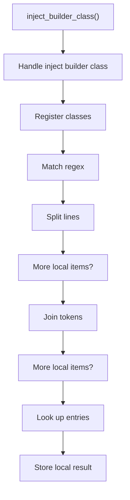
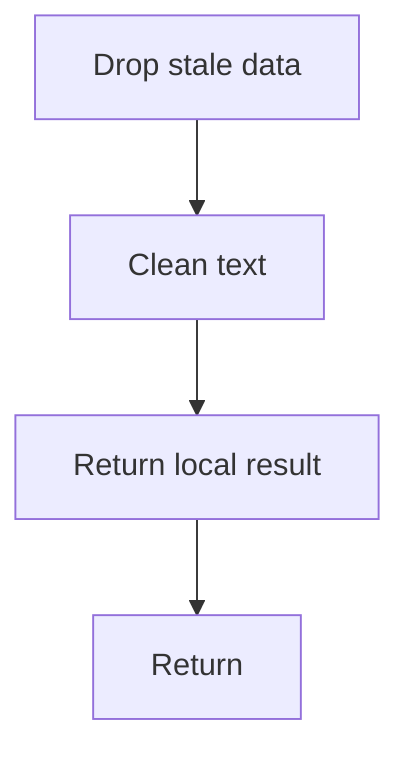

# inject_builder_class.cpp

- Source document: [creational_transform_rules.cpp.md](../../core.cpp.md)
- Purpose: decoupled implementation logic for a future code unit.

### inject_builder_class()
This routine owns one focused piece of the file's behavior.

Inside the body, it mainly handles inspect or register class-level information, match source text with regular expressions, split the source into individual lines, and reassemble token or line collections into text.

The implementation iterates over a collection or repeated workload. It branches on runtime conditions instead of following one fixed path. The caller receives a computed result or status from this step.

What it does:
- inspect or register class-level information
- match source text with regular expressions
- split the source into individual lines
- reassemble token or line collections into text
- look up local indexes
- store local findings
- drop stale entries or obsolete source fragments
- normalize raw text before later parsing
- read local tokens
- connect local structures
- serialize report content
- generate code or evidence output
- walk the local collection
- branch on local conditions

Flow:

### Block 5 - inject_builder_class() Details
#### Slice 1 - Establish Local Entry
Quick summary: This slice shows the first file-local stage for inject_builder_class.cpp and keeps the diagram scoped to this code unit.
Why this is separate: inject_builder_class.cpp has multiple branches, loops, or stage changes, so this section is split out to keep one major intent visible at a time instead of forcing one oversized diagram.

#### Slice 2 - Handle Early Decisions
Quick summary: This slice shows the first local decision path for inject_builder_class.cpp after setup.
Why this is separate: inject_builder_class.cpp has multiple branches, loops, or stage changes, so this section is split out to keep one major intent visible at a time instead of forcing one oversized diagram.

