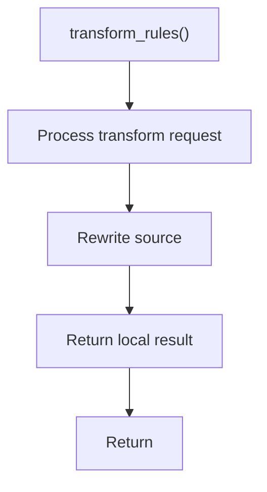

# transform_rules.cpp

- Source document: [creational_transform_rules.cpp.md](../../core.cpp.md)
- Purpose: decoupled implementation logic for a future code unit.

### transform_rules()
This routine owns one focused piece of the file's behavior.

Inside the body, it mainly handles rewrite source text or model state.

The caller receives a computed result or status from this step.

What it does:
- rewrite source text or model state

Flow:

