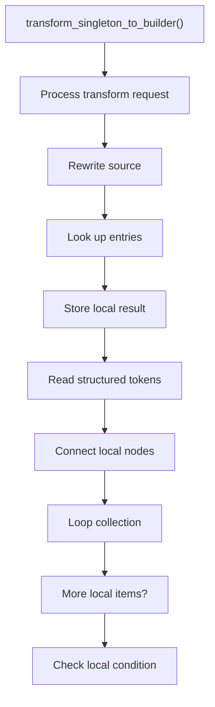
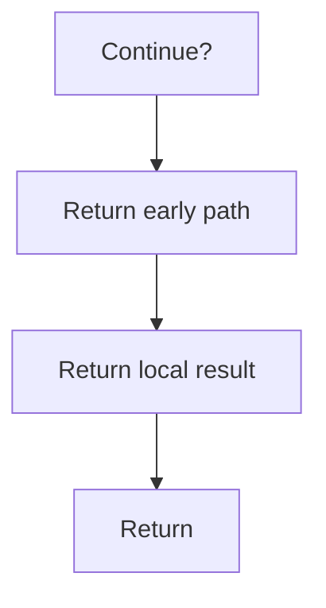

# transform_singleton_to_builder.cpp

- Source document: [creational_transform_rules.cpp.md](../../core.cpp.md)
- Purpose: decoupled implementation logic for a future code unit.

### transform_singleton_to_builder()
This routine owns one focused piece of the file's behavior.

Inside the body, it mainly handles rewrite source text or model state, look up local indexes, store local findings, and read local tokens.

The implementation iterates over a collection or repeated workload. It branches on runtime conditions instead of following one fixed path. The caller receives a computed result or status from this step.

What it does:
- rewrite source text or model state
- look up local indexes
- store local findings
- read local tokens
- connect local structures
- walk the local collection
- branch on local conditions

Flow:

### Block 8 - transform_singleton_to_builder() Details
#### Slice 1 - Establish Local Entry
Quick summary: This slice shows the first file-local stage for transform_singleton_to_builder.cpp and keeps the diagram scoped to this code unit.
Why this is separate: transform_singleton_to_builder.cpp has multiple branches, loops, or stage changes, so this section is split out to keep one major intent visible at a time instead of forcing one oversized diagram.

#### Slice 2 - Handle Early Decisions
Quick summary: This slice shows the first local decision path for transform_singleton_to_builder.cpp after setup.
Why this is separate: transform_singleton_to_builder.cpp has multiple branches, loops, or stage changes, so this section is split out to keep one major intent visible at a time instead of forcing one oversized diagram.

