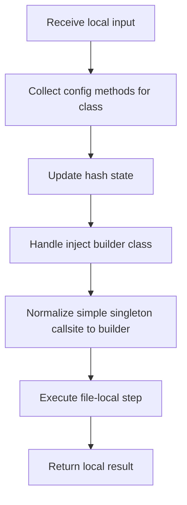

# creational_transform_rules.cpp

- Source: Microservice/Modules/Source/Creational/Transform/creational_transform_rules.cpp
- Kind: C++ implementation

## Story
### What Happens Here

This source file belongs to the older creational transform support path. It is useful for understanding previous rewrite behavior, but the current analyzer runtime focuses on tagging evidence instead of generating replacement code. This source file implements creational-pattern analysis against completed class-declaration subtrees. It inspects parsed structure, applies pattern-specific rules, and emits detector results that later appear in the creational tree or documentation tags.

### Why It Matters In The Flow

Runs after a specific class-declaration subtree exists so creational detection can evaluate that completed class.

### What To Watch While Reading

Implements creational transform dispatch, evidence rendering, and rewrite helpers. The main surface area is easiest to track through symbols such as ConfigMethodModel, ClassBuilderModel, TransformRule, and derive_field_base_name. It collaborates directly with Transform/creational_code_generator_internal.hpp, Transform/creational_transform_factory_reverse.hpp, parse_tree_symbols.hpp, and cctype.

## Program Flow
Quick summary: this diagram shows the file-local activity path for this implementation unit. It stays inside this code file and uses only entry and return boundaries as external references.

Why this slice is separate: deeper helper docs can explain individual functions, while this file still needs to show the main activity path in place.

Detailed program flow is decoupled into future implementation units:

- [program_flow](./Flow/creational_transform_rules_program_flow.cpp.md)
## Reading Map
Read this file as: Implements creational transform dispatch, evidence rendering, and rewrite helpers.

Where it sits in the run: Runs after a specific class-declaration subtree exists so creational detection can evaluate that completed class.

Names worth recognizing while reading: ConfigMethodModel, ClassBuilderModel, TransformRule, derive_field_base_name, collect_config_methods_for_class, and generate_builder_class_code.

It leans on nearby contracts or tools such as Transform/creational_code_generator_internal.hpp, Transform/creational_transform_factory_reverse.hpp, parse_tree_symbols.hpp, cctype, regex, and sstream.

## Story Groups

### Finding What Matters
These steps pick out the facts, traces, and relationships that later stages need.
- collect_config_methods_for_class(): Collect derived facts for later stages, inspect or register class-level information, and look up local indexes

### Building The Working Picture
These steps assemble the trees, models, or bundles used by the rest of the file.
- derive_field_base_name(): store local findings, normalize raw text before later parsing, and connect local structures
- inject_builder_class(): Inspect or register class-level information, match source text with regular expressions, and split the source into individual lines
- rewrite_simple_singleton_callsite_to_builder(): Rewrite source text or model state, recognize or rewrite callsite structure, and match source text with regular expressions
- transform_to_singleton_by_class_references(): Rewrite source text or model state, inspect or register class-level information, and look up local indexes
- transform_singleton_to_builder(): Rewrite source text or model state, look up local indexes, and store local findings

### Changing Or Cleaning The Picture
These steps adjust existing state or remove stale pieces after better information is available.
- transform_factory_to_base(): Rewrite source text or model state and handle factory-specific detection or rewrite logic
- transform_rules(): Rewrite source text or model state
- transform_using_registered_rule(): Rewrite source text or model state, walk the local collection, and branch on local conditions

### Supporting Steps
These steps support the local behavior of the file.
- generate_builder_class_code(): Inspect or register class-level information, fill local output fields, and serialize report content
- pattern_matches(): Owns a focused local responsibility.

## Function Stories
Function-level logic is decoupled into future implementation units:

- [derive_field_base_name](./Flow/functions/derive_field_base_name.cpp.md)
- [collect_config_methods_for_class](./Flow/functions/collect_config_methods_for_class.cpp.md)
- [generate_builder_class_code](./Flow/functions/generate_builder_class_code.cpp.md)
- [inject_builder_class](./Flow/functions/inject_builder_class.cpp.md)
- [rewrite_simple_singleton_callsite_to_builder](./Flow/functions/rewrite_simple_singleton_callsite_to_builder.cpp.md)
- [transform_to_singleton_by_class_references](./Flow/functions/transform_to_singleton_by_class_references.cpp.md)
- [transform_factory_to_base](./Flow/functions/transform_factory_to_base.cpp.md)
- [transform_singleton_to_builder](./Flow/functions/transform_singleton_to_builder.cpp.md)
- [pattern_matches](./Flow/functions/pattern_matches.cpp.md)
- [transform_rules](./Flow/functions/transform_rules.cpp.md)
- [transform_using_registered_rule](./Flow/functions/transform_using_registered_rule.cpp.md)
## Documentation Note
- This markdown file is part of the generated docs/Codebase mirror.
- It was generated from the repository state on 2026-04-23 after reading the existing docs corpus and the current source tree.