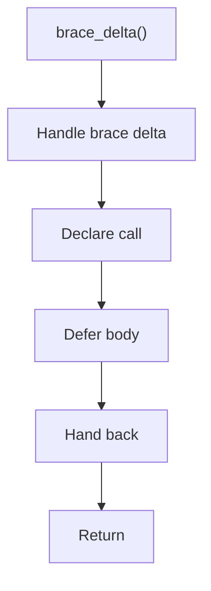

# brace_delta.cpp

- Source document: [creational_transform_evidence_internal.hpp.md](../../creational_transform_evidence_internal.hpp.md)
- Purpose: decoupled implementation logic for a future code unit.

### brace_delta()
This declaration exposes a callable contract without providing the runtime body here.

Inside the body, it mainly handles declare a callable contract and let implementation files define the runtime body.

What it does:
- declare a callable contract
- let implementation files define the runtime body

Flow:

