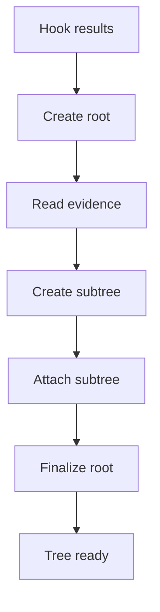
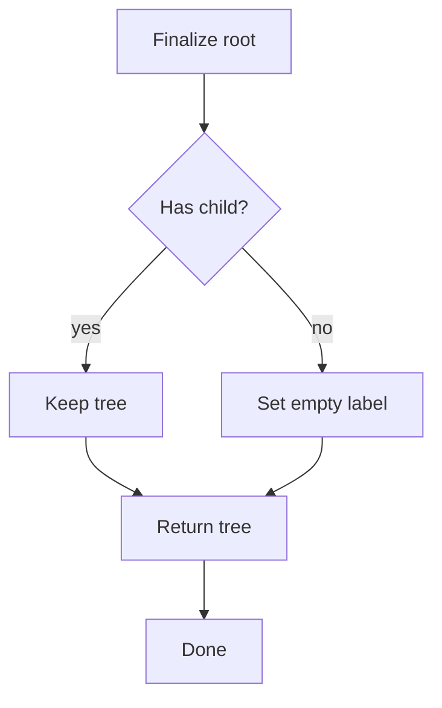
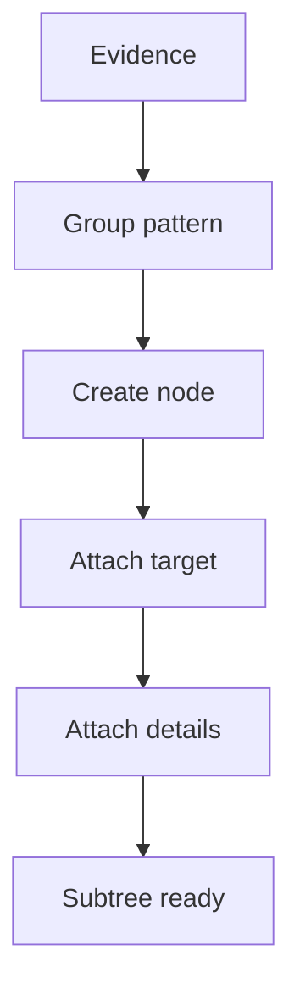

# pattern_tree_assembler.cpp

## Role
Builds the returned tree from hook evidence. Hooks do not assemble the final tree.

## Intended Source Role
This file maps to the future tree assembler. It is the only module allowed to create the final pattern tree shape.

## Assembly Flow

## Empty Flow

## Node Shape
- Family root.
- Pattern node.
- Target class node.
- Evidence node.
- Related symbol node.
- Diagnostic node.

## Evidence Flow

## Ordering Rule
Assembler should sort or preserve records in one place. Pattern hooks should not decide final output ordering.
