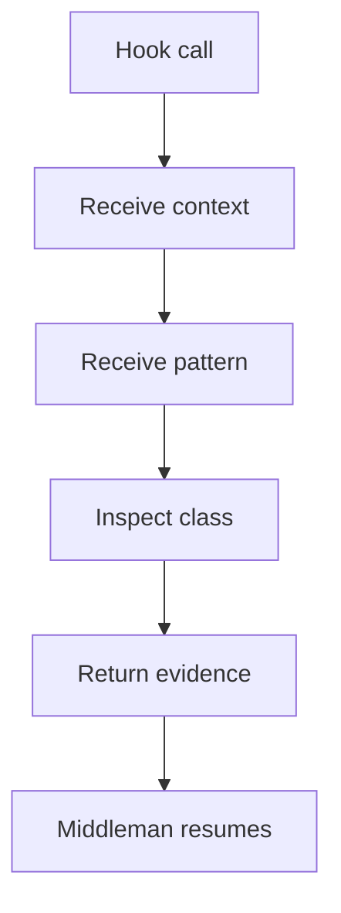
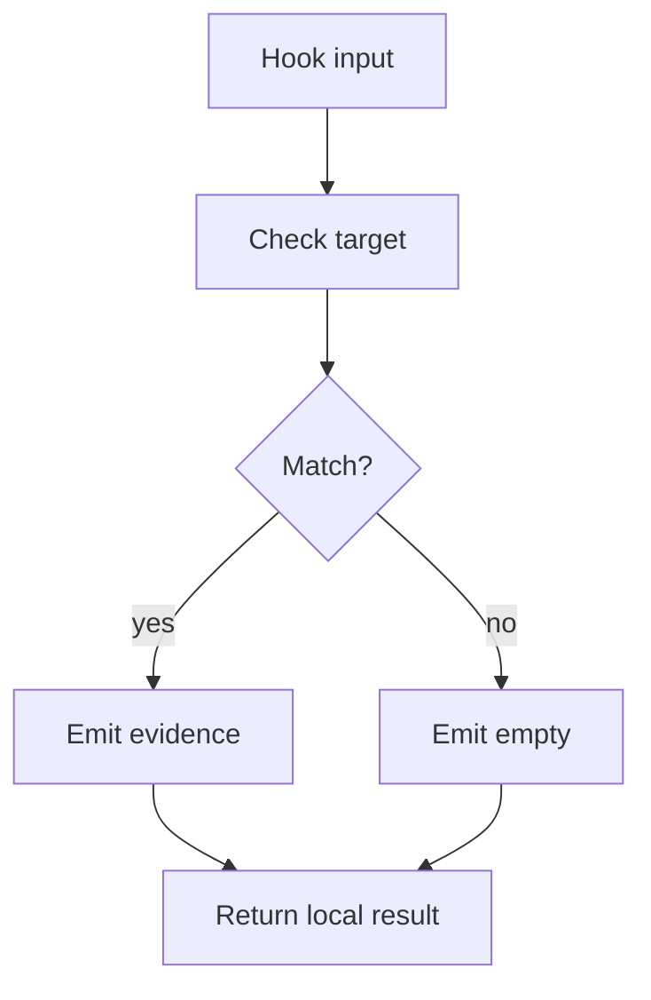

# pattern_hook_contract.cpp

## Role
Defines how pattern-specific algorithms plug into catalog-driven recognition. The hook may be a virtual function, function pointer, or equivalent callback.

## Intended Source Role
This file maps to the future hook interface. Every Factory, Singleton, Builder, Strategy, Observer, or scaffold detector must fit this same callable shape when catalog rules need custom evidence.
The contract should stay generic enough that each family can return its own evidence shape, but the dispatcher can still call them through one shared interface.
The shared template/checker types are owned by `pattern_middleman_contract.cpp.md` and are passed into this hook contract as needed.

## Hook Contract Flow

## Hook Rules
- Do not register classes.
- Do not register functions.
- Do not create root nodes.
- Do not assemble final trees.
- Do only pattern-specific logic.
- Return empty output when no match exists.
- Do not decide which catalog entries are active.
- If the catalog already describes enough ordered structure, the hook should only add the missing family-specific evidence instead of re-parsing the whole tree.

## Hook Inputs
- Shared context.
- Current catalog pattern definition.
- `PatternTemplateNode` when the catalog entry is described as an ordered nested layout.
- `PatternScaffold` when the hook needs a reusable pattern shape.
- `PatternStructureChecker` when the hook needs to verify the scaffold against the candidate.
- Current class record.
- Related function records.
- Pattern options.
- Evidence sink.
- Hook input may also include a scoped lexeme layout or prebuilt structural layout from the catalog when the pattern is described as nested order rather than a flat token list.

## Hook Output
- Match flag.
- Pattern name.
- Target class.
- Related functions.
- Evidence notes.
- Confidence or reason.

## Rejection Flow

