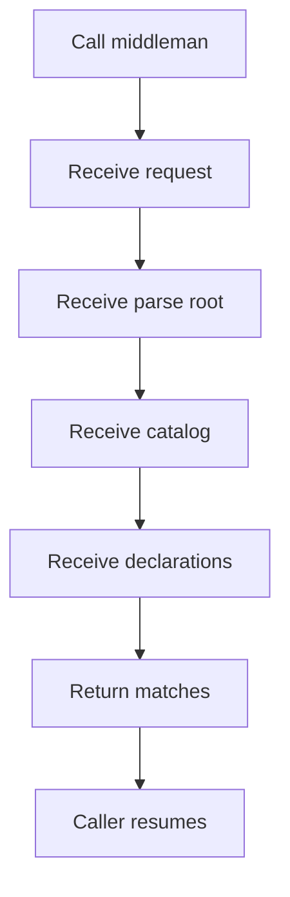
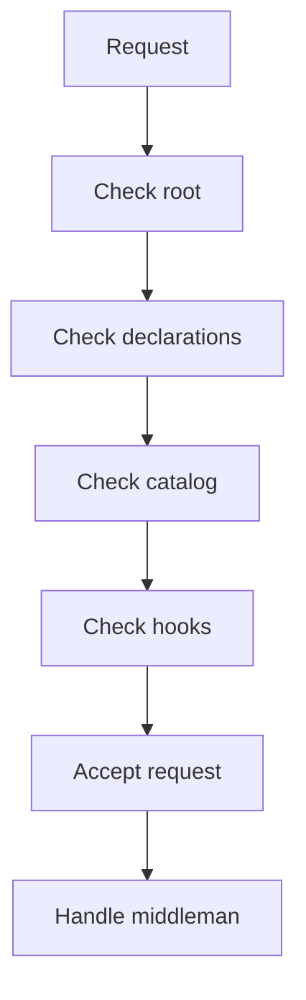

# pattern_middleman_contract.cpp

## Role
Defines the single public entrypoint for automated pattern recognition and pattern result assembly. This contract is shared by Behavioural and Creational callers.

## Intended Source Role
This file maps to the future public middleman interface. It should expose one recognition request shape and one result shape for every supported pattern family.

## Contract Flow

## Responsibilities
- Provide one entrypoint.
- Accept normalized catalog definitions.
- Accept generated class declarations.
- Check Behavioural definitions.
- Check Creational definitions.
- Hide shared assembly details.
- Return finished match evidence.
- Avoid family-specific middlemen.

## Shared Pattern Types
These shared types belong to the Middleman contract layer because they are used by every family-specific hook and by the dispatcher before any family code runs.

- `PatternTemplateNode`: normalized ordered pattern node used to describe the catalog layout.
- `PatternScaffold`: shared structural template passed to hooks when a pattern is defined as a nested class/function/control-block shape.
- `PatternStructureChecker`: shared checker contract used to verify whether the candidate matches the template.

These types are not owned by `Families/Behavioural/` or `Families/Creational/`. Family docs should only consume them.

## Request Fields
- Parse root pointer.
- Generated class declaration registry.
- Normalized pattern catalog.
- Optional enabled pattern filter.
- Scan options.
- Output labels.
- Error policy.

## Result Fields
- Result root.
- Matched children.
- Evidence records.
- Empty-result flag.
- Diagnostic messages.

## Validation Flow

## Automation Rule
- The request must not require a source design-pattern value.
- If a pattern filter exists, it narrows the catalog; it does not replace catalog-driven recognition.
- The default request checks every enabled catalog entry against the generated class declarations.
