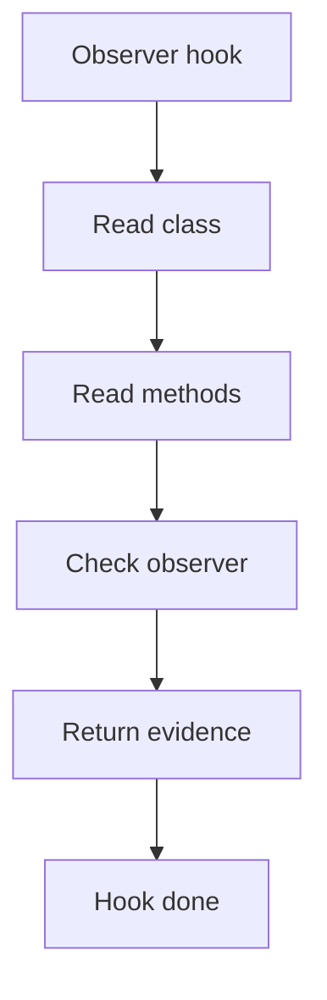

# observer_hook.cpp

## Role
Detects observer evidence from the shared middleman context.

## Intended Source Role
This file maps to the Observer hook implementation. It should only contain Observer-specific checks.

## Hook Flow

## Algorithm Steps
1. Read candidate subject classes.
2. Find observer collection fields.
3. Find attach or subscribe methods.
4. Find notify loop or callback call.
5. Return Observer evidence to dispatcher.

## Evidence Fields
- Subject class.
- Observer type.
- Attach method.
- Notify method.
- Confidence reason.
