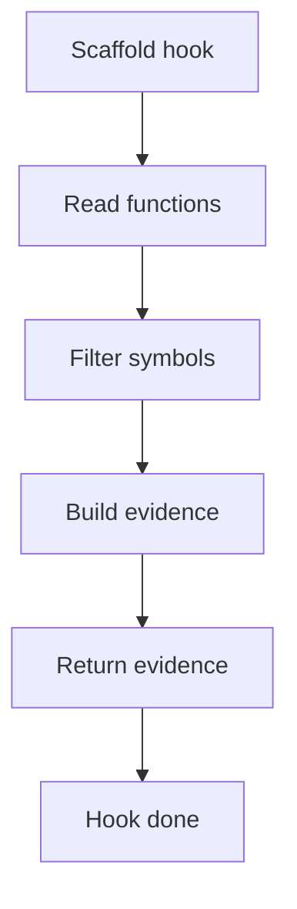

# scaffold_hook.cpp

## Role
Detects behavioural scaffold evidence from the shared middleman context.

## Intended Source Role
This file maps to a shared behavioural scaffold hook. It should cover reusable behavioural checks without becoming a second middleman.

## Hook Flow

## Algorithm Steps
1. Read registered functions.
2. Filter behaviour-related symbols.
3. Group functions by owning class.
4. Create scaffold evidence for later assembly.
5. Return scaffold evidence to dispatcher.

## Evidence Fields
- Owning class.
- Behaviour method.
- Related symbol.
- Scaffold reason.
- Confidence reason.
