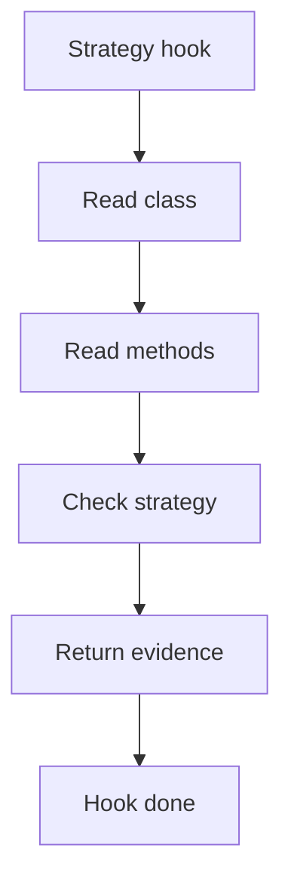

# strategy_hook.cpp

## Role
Detects strategy evidence from the shared middleman context.

## Intended Source Role
This file maps to the Strategy hook implementation. It should only contain Strategy-specific checks.

## Hook Flow

## Algorithm Steps
1. Read candidate context classes.
2. Find interchangeable behaviour references.
3. Find setter or constructor injection.
4. Find delegated behaviour calls.
5. Return Strategy evidence to dispatcher.

## Evidence Fields
- Context class.
- Strategy interface.
- Concrete strategy.
- Delegated method.
- Confidence reason.
