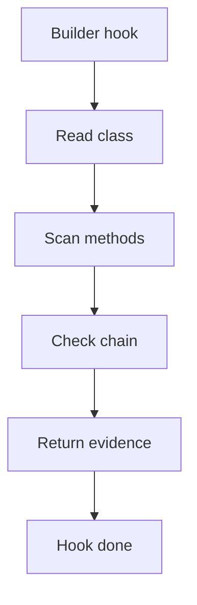

# builder_hook.cpp

## Role
Detects builder evidence from the shared middleman context.

## Intended Source Role
This file maps to the Builder hook implementation. It should only contain Builder-specific checks.

## Hook Flow

## Algorithm Steps
1. Read each registered class from context.
2. Find chained setter-like methods.
3. Find final build or create method.
4. Link builder methods to produced type.
5. Return Builder evidence to dispatcher.

## Evidence Fields
- Builder class.
- Chain methods.
- Build method.
- Produced type.
- Confidence reason.
