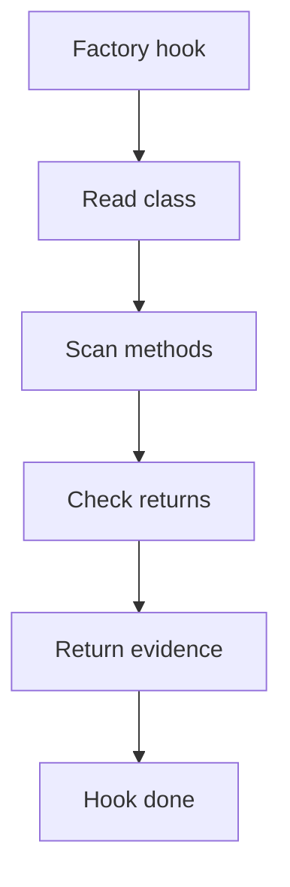

# factory_hook.cpp

## Role
Detects factory evidence from the shared middleman context.

## Intended Source Role
This file maps to the Factory hook implementation. It should only contain Factory-specific checks.

## Hook Flow

## Algorithm Steps
1. Read each registered class from context.
2. Find methods that construct or return other types.
3. Compare return types against registered classes.
4. Confirm object creation or delegated creation evidence.
5. Return Factory evidence to dispatcher.

## Evidence Fields
- Factory class.
- Factory method.
- Produced type.
- Creation call.
- Confidence reason.
