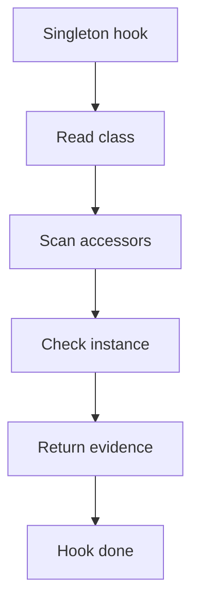

# singleton_hook.cpp

## Role
Detects singleton evidence from the shared middleman context.

## Intended Source Role
This file maps to the Singleton hook implementation. It should only contain Singleton-specific checks.

## Hook Flow

## Algorithm Steps
1. Read each registered class from context.
2. Find static instance fields or equivalent storage.
3. Find private or restricted constructors.
4. Find public accessor methods.
5. Return Singleton evidence to dispatcher.

## Evidence Fields
- Singleton class.
- Instance field.
- Accessor method.
- Constructor visibility.
- Confidence reason.
