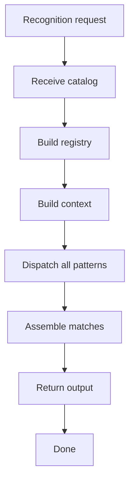
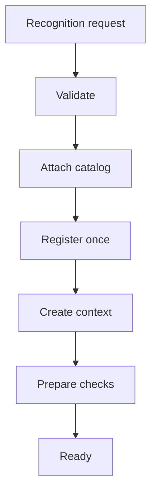
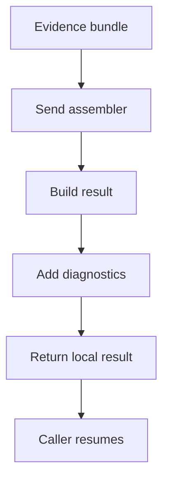

# pattern_middleman.cpp

## Role
Coordinates catalog definitions, registry, context, dispatcher, and assembler. This is the one middleman for automated pattern logic across supported families.

## Intended Source Role
This file maps to the future orchestration implementation. It is the only module that knows the complete shared process after catalog parsing has completed.

## Orchestration Flow

## Ownership
- Uses catalog definitions that were already parsed and validated.
- Calls registry.
- Calls context builder.
- Calls dispatcher.
- Calls assembler.
- Does not run pattern algorithms directly.
- Does not duplicate Behavioural and Creational paths.

## Detailed Steps
1. Validate the recognition request through the middleman contract.
2. Receive normalized catalog definitions.
3. Build one registry from generated class declarations and parse data.
4. Create one context from request, catalog, registry, and symbol data.
5. Ask dispatcher to check every enabled catalog pattern.
6. Run needed hooks through the hook contract.
7. Pass evidence results to assembler.
8. Return one final pattern result to the caller.

## Shared Setup Flow

## Output Flow

