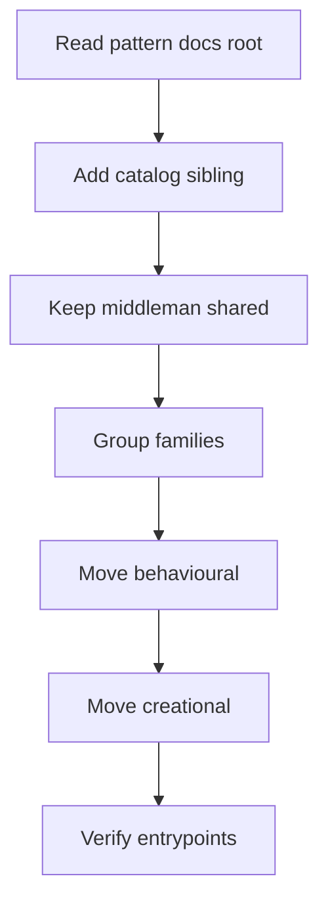

# current_to_middleman.cpp

## Role
Documents the accepted path migration for catalog-driven pattern analysis docs.

## Current Outer Split
```text
Patterns/
  Catalog/
  Middleman/
  Families/
    Behavioural/
    Creational/
```

## Activity Flow
Quick summary: this migration adds a catalog layer for data-driven recognition, keeps the shared middleman layer outside the family group, then routes family-specific docs through `Families/`.

Why this slice is separate: path migration is a docs-architecture concern; it should not be mixed with behavioural or creational implementation diagrams.



## Direct Mapping
- Former top-level Behavioural family folder -> `Patterns/Families/Behavioural/`
- Former top-level Creational family folder -> `Patterns/Families/Creational/`
- New pattern definition data -> `Patterns/Catalog/`
- `Patterns/Middleman/` stays at `Patterns/Middleman/`

## Naming Rules
- Family names belong under the `Families/` grouping folder.
- Catalog files belong under `Catalog/` because they are shared data, not a pattern family.
- Middleman stays outside `Families/` because it is shared orchestration, not a family.
- File names should carry only the local implementation role once the folder path carries the family.

## Acceptance Checks
- `Patterns/Families/Behavioural/` exists.
- `Patterns/Families/Creational/` exists.
- `Patterns/Catalog/` exists as the pattern definition entrypoint.
- `Patterns/Middleman/` exists as a sibling of `Patterns/Families/`.
- No durable docs point readers to top-level family folders.
